# Atloop Architecture Documentation

## Table of Contents

1. [System Overview](#1-system-overview)
2. [High-Level Architecture](#2-high-level-architecture)
3. [Component Architecture](#3-component-architecture)
4. [Data Flow Diagrams](#4-data-flow-diagrams)
5. [Workflow State Machine](#5-workflow-state-machine)
6. [Memory System Architecture](#6-memory-system-architecture)
7. [Context Pack Architecture](#7-context-pack-architecture)
8. [Tool Execution Flow](#8-tool-execution-flow)
9. [Error Handling Flow](#9-error-handling-flow)
10. [State Management](#10-state-management)

---

## 1. System Overview

atloop is an autonomous AI agent system that executes coding tasks through a structured workflow. The system orchestrates LLM interactions, tool execution, and state management to complete tasks autonomously.

### Core Principles

1. **Structured Workflow**: DISCOVER → PLAN → ACT → VERIFY cycle
2. **State Persistence**: All state is persisted and resumable
3. **Error Recovery**: Automatic error classification and recovery
4. **Memory Management**: Intelligent memory compression and formatting
5. **Sandbox Isolation**: All changes execute in isolated environments

---

## 2. High-Level Architecture

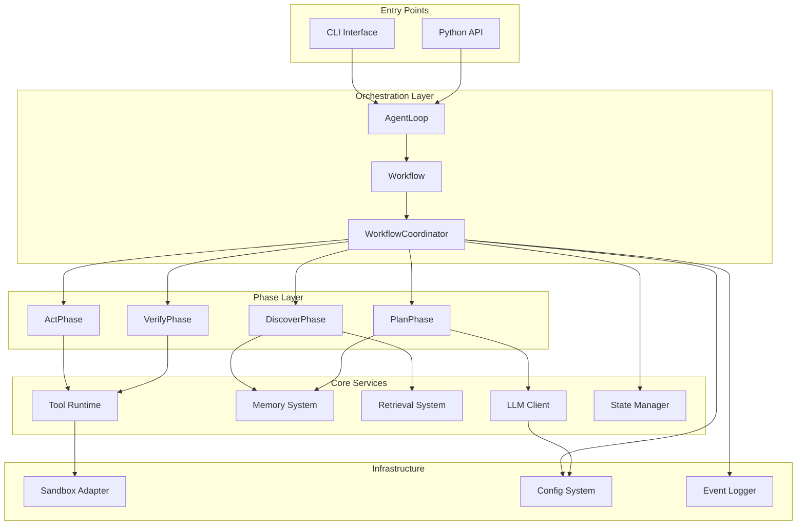
```mermaid
graph TB
    subgraph "Entry Points"
        CLI[CLI Interface]
        API[Python API]
    end
    
    subgraph "Orchestration Layer"
        AL[AgentLoop]
        WF[Workflow]
        COORD[WorkflowCoordinator]
    end
    
    subgraph "Phase Layer"
        DISCOVER[DiscoverPhase]
        PLAN[PlanPhase]
        ACT[ActPhase]
        VERIFY[VerifyPhase]
    end
    
    subgraph "Core Services"
        LLM[LLM Client]
        MEMORY[Memory System]
        RETRIEVAL[Retrieval System]
        TOOLS[Tool Runtime]
        STATE[State Manager]
    end
    
    subgraph "Infrastructure"
        SANDBOX[Sandbox Adapter]
        CONFIG[Config System]
        LOGGER[Event Logger]
    end
    
    CLI --> AL
    API --> AL
    AL --> WF
    WF --> COORD
    COORD --> DISCOVER
    COORD --> PLAN
    COORD --> ACT
    COORD --> VERIFY
    
    DISCOVER --> RETRIEVAL
    DISCOVER --> MEMORY
    PLAN --> LLM
    PLAN --> MEMORY
    ACT --> TOOLS
    VERIFY --> TOOLS
    
    COORD --> STATE
    COORD --> CONFIG
    COORD --> LOGGER
    TOOLS --> SANDBOX
    LLM --> CONFIG
```

---

## 3. Component Architecture

### 3.1 Orchestrator Components

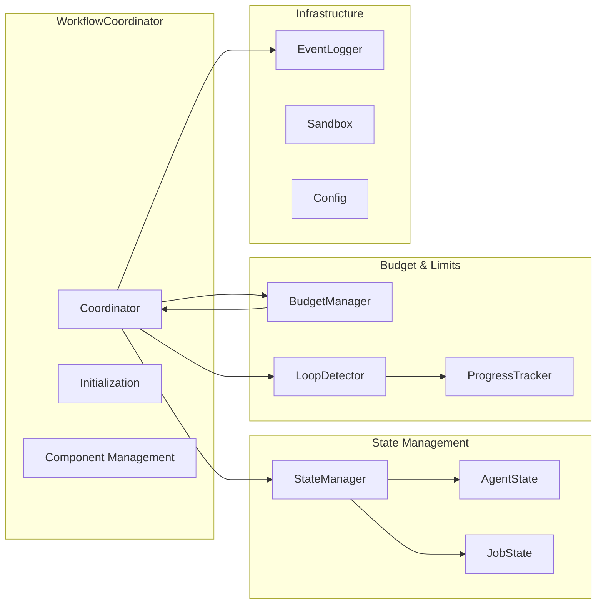
```mermaid
graph LR
    subgraph "WorkflowCoordinator"
        COORD[Coordinator]
        INIT[Initialization]
        COMP[Component Management]
    end
    
    subgraph "State Management"
        SM[StateManager]
        AS[AgentState]
        JS[JobState]
    end
    
    subgraph "Budget & Limits"
        BM[BudgetManager]
        LD[LoopDetector]
        PT[ProgressTracker]
    end
    
    subgraph "Infrastructure"
        EL[EventLogger]
        SB[Sandbox]
        CFG[Config]
    end
    
    COORD --> SM
    COORD --> BM
    COORD --> LD
    COORD --> EL
    SM --> AS
    SM --> JS
    BM --> COORD
    LD --> PT
```

### 3.2 Phase Components

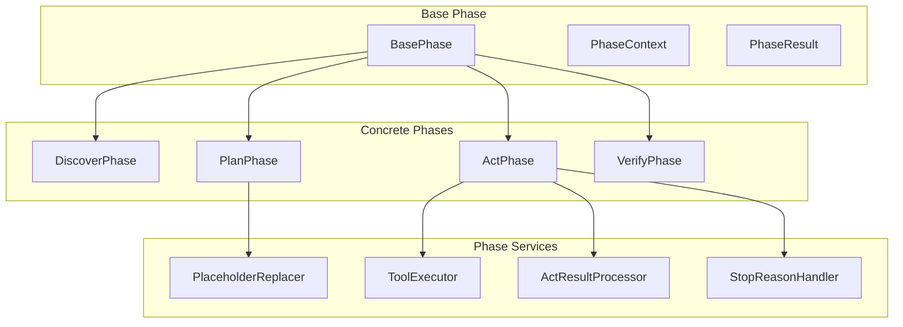
```mermaid
graph TB
    subgraph "Base Phase"
        BP[BasePhase]
        PC[PhaseContext]
        PR[PhaseResult]
    end
    
    subgraph "Concrete Phases"
        DP[DiscoverPhase]
        PP[PlanPhase]
        AP[ActPhase]
        VP[VerifyPhase]
    end
    
    subgraph "Phase Services"
        TE[ToolExecutor]
        ARP[ActResultProcessor]
        PR2[PlaceholderReplacer]
        SRH[StopReasonHandler]
    end
    
    BP --> DP
    BP --> PP
    BP --> AP
    BP --> VP
    
    AP --> TE
    AP --> ARP
    PP --> PR2
    AP --> SRH
```

---

## 4. Data Flow Diagrams

### 4.1 Overall Execution Flow

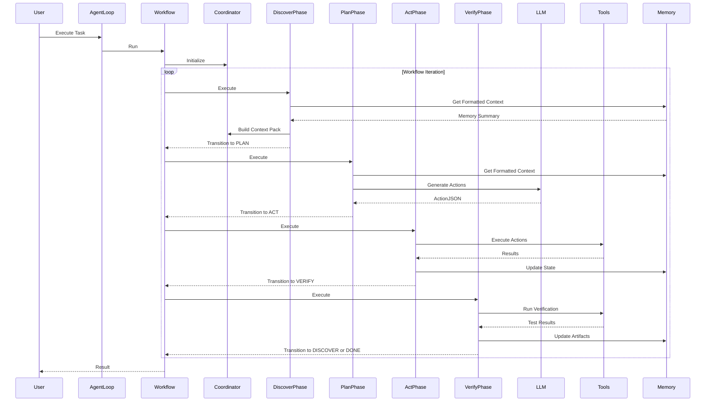
```mermaid
sequenceDiagram
    participant User
    participant AgentLoop
    participant Workflow
    participant Coordinator
    participant DiscoverPhase
    participant PlanPhase
    participant ActPhase
    participant VerifyPhase
    participant LLM
    participant Tools
    participant Memory
    
    User->>AgentLoop: Execute Task
    AgentLoop->>Workflow: Run
    Workflow->>Coordinator: Initialize
    
    loop Workflow Iteration
        Workflow->>DiscoverPhase: Execute
        DiscoverPhase->>Memory: Get Formatted Context
        Memory-->>DiscoverPhase: Memory Summary
        DiscoverPhase->>Coordinator: Build Context Pack
        DiscoverPhase-->>Workflow: Transition to PLAN
        
        Workflow->>PlanPhase: Execute
        PlanPhase->>Memory: Get Formatted Context
        PlanPhase->>LLM: Generate Actions
        LLM-->>PlanPhase: ActionJSON
        PlanPhase-->>Workflow: Transition to ACT
        
        Workflow->>ActPhase: Execute
        ActPhase->>Tools: Execute Actions
        Tools-->>ActPhase: Results
        ActPhase->>Memory: Update State
        ActPhase-->>Workflow: Transition to VERIFY
        
        Workflow->>VerifyPhase: Execute
        VerifyPhase->>Tools: Run Verification
        Tools-->>VerifyPhase: Test Results
        VerifyPhase->>Memory: Update Artifacts
        VerifyPhase-->>Workflow: Transition to DISCOVER or DONE
    end
    
    Workflow-->>User: Result
```

### 4.2 Memory to Context Pack Flow

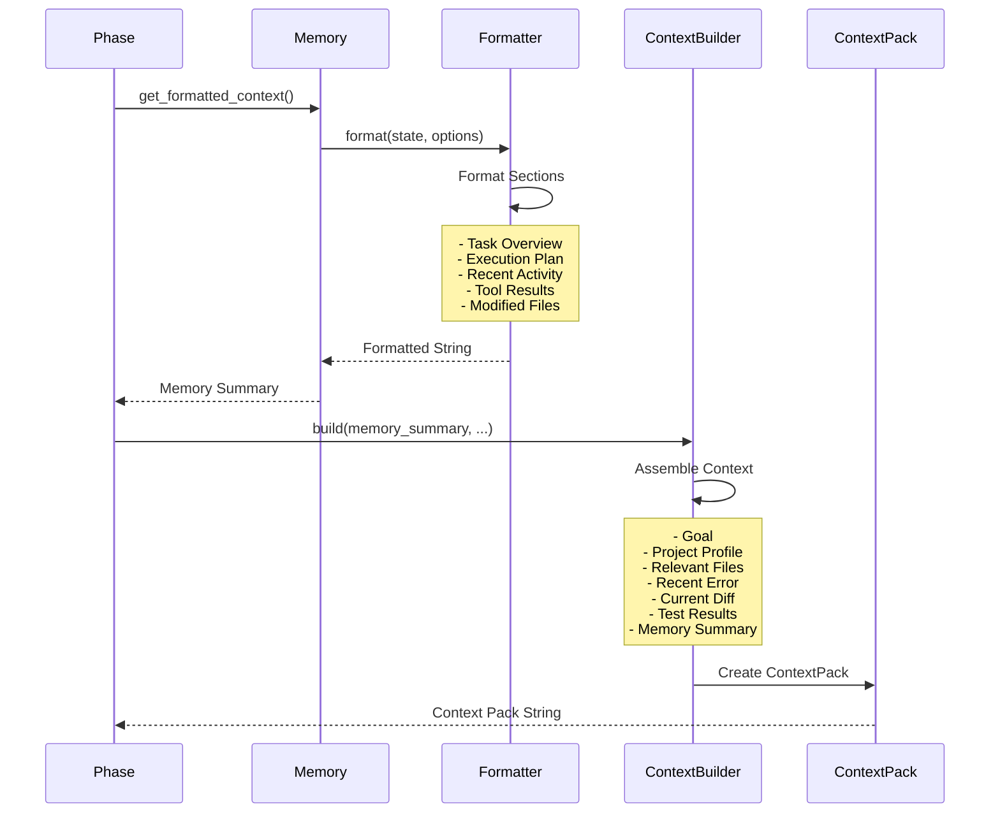
```mermaid
sequenceDiagram
    participant Phase
    participant Memory
    participant Formatter
    participant ContextBuilder
    participant ContextPack
    
    Phase->>Memory: get_formatted_context()
    Memory->>Formatter: format(state, options)
    Formatter->>Formatter: Format Sections
    Note over Formatter: - Task Overview<br/>- Execution Plan<br/>- Recent Activity<br/>- Tool Results<br/>- Modified Files
    Formatter-->>Memory: Formatted String
    Memory-->>Phase: Memory Summary
    
    Phase->>ContextBuilder: build(memory_summary, ...)
    ContextBuilder->>ContextBuilder: Assemble Context
    Note over ContextBuilder: - Goal<br/>- Project Profile<br/>- Relevant Files<br/>- Recent Error<br/>- Current Diff<br/>- Test Results<br/>- Memory Summary
    ContextBuilder->>ContextPack: Create ContextPack
    ContextPack-->>Phase: Context Pack String
```

### 4.3 Tool Execution Flow

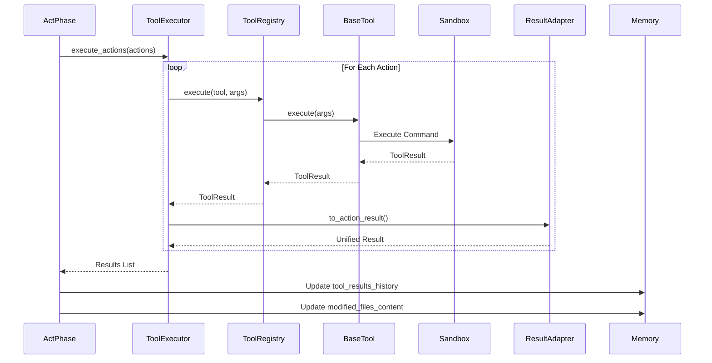
```mermaid
sequenceDiagram
    participant ActPhase
    participant ToolExecutor
    participant ToolRegistry
    participant BaseTool
    participant Sandbox
    participant ResultAdapter
    participant Memory
    
    ActPhase->>ToolExecutor: execute_actions(actions)
    
    loop For Each Action
        ToolExecutor->>ToolRegistry: execute(tool, args)
        ToolRegistry->>BaseTool: execute(args)
        BaseTool->>Sandbox: Execute Command
        Sandbox-->>BaseTool: ToolResult
        BaseTool-->>ToolRegistry: ToolResult
        ToolRegistry-->>ToolExecutor: ToolResult
        ToolExecutor->>ResultAdapter: to_action_result()
        ResultAdapter-->>ToolExecutor: Unified Result
    end
    
    ToolExecutor-->>ActPhase: Results List
    ActPhase->>Memory: Update tool_results_history
    ActPhase->>Memory: Update modified_files_content
```

---

## 5. Workflow State Machine

### 5.1 State Transition Diagram

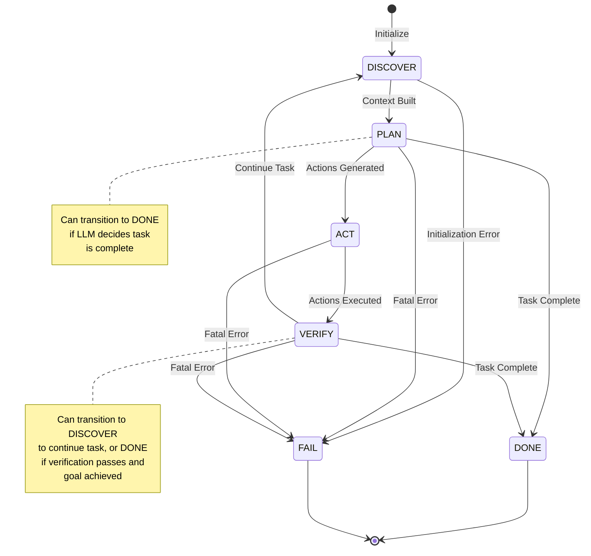
```mermaid
stateDiagram-v2
    [*] --> DISCOVER: Initialize
    
    DISCOVER --> PLAN: Context Built
    DISCOVER --> FAIL: Initialization Error
    
    PLAN --> ACT: Actions Generated
    PLAN --> DONE: Task Complete
    PLAN --> FAIL: Fatal Error
    
    ACT --> VERIFY: Actions Executed
    ACT --> FAIL: Fatal Error
    
    VERIFY --> DISCOVER: Continue Task
    VERIFY --> DONE: Task Complete
    VERIFY --> FAIL: Fatal Error
    
    DONE --> [*]
    FAIL --> [*]
    
    note right of PLAN
        Can transition to DONE
        if LLM decides task
        is complete
    end note
    
    note right of VERIFY
        Can transition to DISCOVER
        to continue task, or DONE
        if verification passes and
        goal achieved
    end note
```

### 5.2 Phase Execution Flow

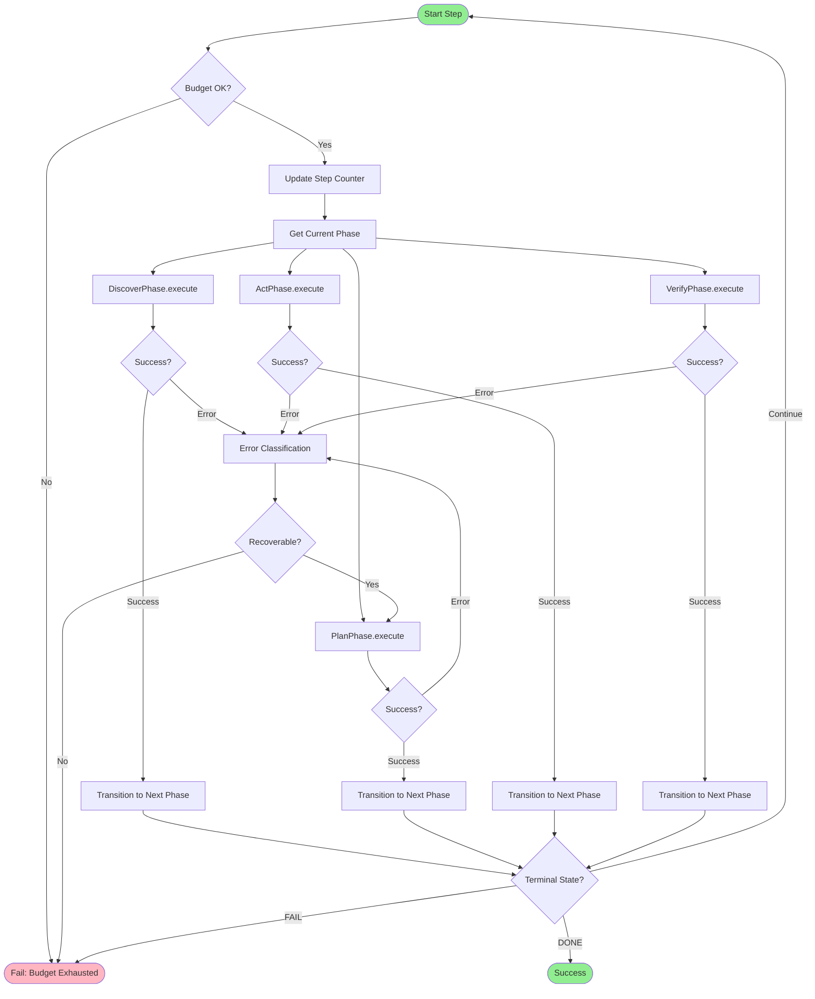
```mermaid
graph TB
    START([Start Step]) --> CHECK_BUDGET{Budget OK?}
    CHECK_BUDGET -->|No| FAIL([Fail: Budget Exhausted])
    CHECK_BUDGET -->|Yes| UPDATE_STEP[Update Step Counter]
    UPDATE_STEP --> GET_PHASE[Get Current Phase]
    
    GET_PHASE --> DISCOVER_PHASE[DiscoverPhase.execute]
    GET_PHASE --> PLAN_PHASE[PlanPhase.execute]
    GET_PHASE --> ACT_PHASE[ActPhase.execute]
    GET_PHASE --> VERIFY_PHASE[VerifyPhase.execute]
    
    DISCOVER_PHASE --> CHECK_RESULT1{Success?}
    PLAN_PHASE --> CHECK_RESULT2{Success?}
    ACT_PHASE --> CHECK_RESULT3{Success?}
    VERIFY_PHASE --> CHECK_RESULT4{Success?}
    
    CHECK_RESULT1 -->|Error| ERROR_HANDLING[Error Classification]
    CHECK_RESULT2 -->|Error| ERROR_HANDLING
    CHECK_RESULT3 -->|Error| ERROR_HANDLING
    CHECK_RESULT4 -->|Error| ERROR_HANDLING
    
    ERROR_HANDLING --> RECOVERABLE{Recoverable?}
    RECOVERABLE -->|Yes| PLAN_PHASE
    RECOVERABLE -->|No| FAIL
    
    CHECK_RESULT1 -->|Success| TRANSITION1[Transition to Next Phase]
    CHECK_RESULT2 -->|Success| TRANSITION2[Transition to Next Phase]
    CHECK_RESULT3 -->|Success| TRANSITION3[Transition to Next Phase]
    CHECK_RESULT4 -->|Success| TRANSITION4[Transition to Next Phase]
    
    TRANSITION1 --> CHECK_TERMINAL{Terminal State?}
    TRANSITION2 --> CHECK_TERMINAL
    TRANSITION3 --> CHECK_TERMINAL
    TRANSITION4 --> CHECK_TERMINAL
    
    CHECK_TERMINAL -->|DONE| SUCCESS([Success])
    CHECK_TERMINAL -->|FAIL| FAIL
    CHECK_TERMINAL -->|Continue| START
    
    style START fill:#90EE90
    style SUCCESS fill:#90EE90
    style FAIL fill:#FFB6C1
```

---

## 6. Memory System Architecture

### 6.1 Memory Data Model

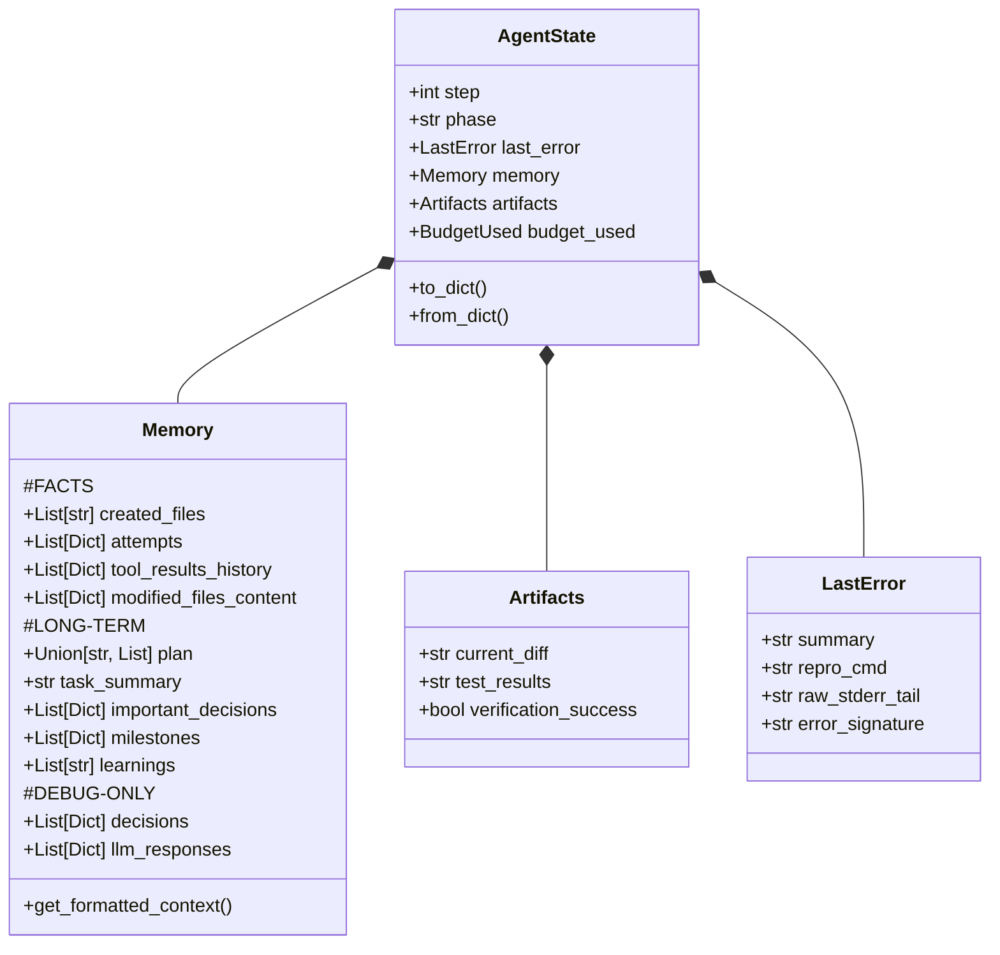
```mermaid
classDiagram
    class AgentState {
        +int step
        +str phase
        +LastError last_error
        +Memory memory
        +Artifacts artifacts
        +BudgetUsed budget_used
        +to_dict()
        +from_dict()
    }
    
    class Memory {
        #FACTS
        +List[str] created_files
        +List[Dict] attempts
        +List[Dict] tool_results_history
        +List[Dict] modified_files_content
        
        #LONG-TERM
        +Union[str, List] plan
        +str task_summary
        +List[Dict] important_decisions
        +List[Dict] milestones
        +List[str] learnings
        
        #DEBUG-ONLY
        +List[Dict] decisions
        +List[Dict] llm_responses
        
        +get_formatted_context()
    }
    
    class Artifacts {
        +str current_diff
        +str test_results
        +bool verification_success
    }
    
    class LastError {
        +str summary
        +str repro_cmd
        +str raw_stderr_tail
        +str error_signature
    }
    
    AgentState *-- Memory
    AgentState *-- Artifacts
    AgentState *-- LastError
```

### 6.2 Memory Formatting Flow

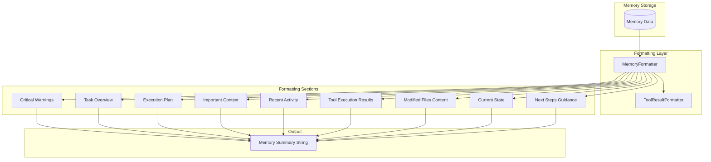
```mermaid
graph TB
    subgraph "Memory Storage"
        MEMORY[(Memory Data)]
    end
    
    subgraph "Formatting Layer"
        MF[MemoryFormatter]
        TRF[ToolResultFormatter]
    end
    
    subgraph "Formatting Sections"
        CO[Critical Warnings]
        TO[Task Overview]
        EP[Execution Plan]
        IC[Important Context]
        RA[Recent Activity]
        TER[Tool Execution Results]
        MFC[Modified Files Content]
        CS[Current State]
        NSG[Next Steps Guidance]
    end
    
    subgraph "Output"
        MS[Memory Summary String]
    end
    
    MEMORY --> MF
    MF --> TRF
    MF --> CO
    MF --> TO
    MF --> EP
    MF --> IC
    MF --> RA
    MF --> TER
    MF --> MFC
    MF --> CS
    MF --> NSG
    
    CO --> MS
    TO --> MS
    EP --> MS
    IC --> MS
    RA --> MS
    TER --> MS
    MFC --> MS
    CS --> MS
    NSG --> MS
```

### 6.3 Memory Compression Flow

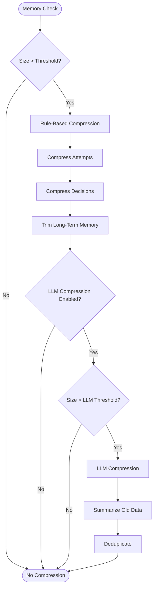
```mermaid
graph TB
    START([Memory Check]) --> CHECK_SIZE{Size > Threshold?}
    CHECK_SIZE -->|No| END([No Compression])
    CHECK_SIZE -->|Yes| RULE_COMPRESS[Rule-Based Compression]
    
    RULE_COMPRESS --> COMPRESS_ATTEMPTS[Compress Attempts]
    COMPRESS_ATTEMPTS --> COMPRESS_DECISIONS[Compress Decisions]
    COMPRESS_DECISIONS --> TRIM_LONG_TERM[Trim Long-Term Memory]
    
    TRIM_LONG_TERM --> CHECK_LLM{LLM Compression Enabled?}
    CHECK_LLM -->|No| END
    CHECK_LLM -->|Yes| CHECK_THRESHOLD{Size > LLM Threshold?}
    
    CHECK_THRESHOLD -->|No| END
    CHECK_THRESHOLD -->|Yes| LLM_COMPRESS[LLM Compression]
    LLM_COMPRESS --> SUMMARIZE[Summarize Old Data]
    SUMMARIZE --> DEDUPLICATE[Deduplicate]
    DEDUPLICATE --> END
```

---

## 7. Context Pack Architecture

### 7.1 Context Pack Structure

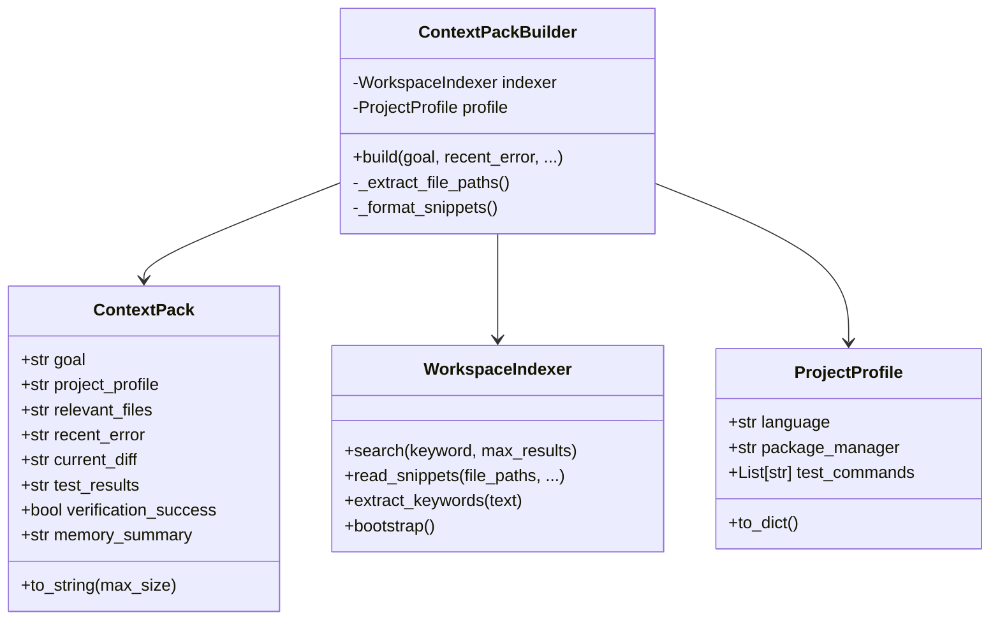
```mermaid
classDiagram
    class ContextPack {
        +str goal
        +str project_profile
        +str relevant_files
        +str recent_error
        +str current_diff
        +str test_results
        +bool verification_success
        +str memory_summary
        +to_string(max_size)
    }
    
    class ContextPackBuilder {
        -WorkspaceIndexer indexer
        -ProjectProfile profile
        +build(goal, recent_error, ...)
        -_extract_file_paths()
        -_format_snippets()
    }
    
    class WorkspaceIndexer {
        +search(keyword, max_results)
        +read_snippets(file_paths, ...)
        +extract_keywords(text)
        +bootstrap()
    }
    
    class ProjectProfile {
        +str language
        +str package_manager
        +List[str] test_commands
        +to_dict()
    }
    
    ContextPackBuilder --> ContextPack
    ContextPackBuilder --> WorkspaceIndexer
    ContextPackBuilder --> ProjectProfile
```

### 7.2 Context Pack Assembly Flow

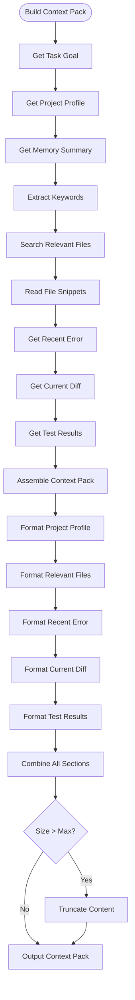
```mermaid
graph TB
    START([Build Context Pack]) --> GET_GOAL[Get Task Goal]
    GET_GOAL --> GET_PROFILE[Get Project Profile]
    GET_PROFILE --> GET_MEMORY[Get Memory Summary]
    
    GET_MEMORY --> EXTRACT_KEYWORDS[Extract Keywords]
    EXTRACT_KEYWORDS --> SEARCH_FILES[Search Relevant Files]
    SEARCH_FILES --> READ_SNIPPETS[Read File Snippets]
    
    READ_SNIPPETS --> GET_ERROR[Get Recent Error]
    GET_ERROR --> GET_DIFF[Get Current Diff]
    GET_DIFF --> GET_TESTS[Get Test Results]
    
    GET_TESTS --> ASSEMBLE[Assemble Context Pack]
    ASSEMBLE --> FORMAT_PROFILE[Format Project Profile]
    FORMAT_PROFILE --> FORMAT_FILES[Format Relevant Files]
    FORMAT_FILES --> FORMAT_ERROR[Format Recent Error]
    FORMAT_ERROR --> FORMAT_DIFF[Format Current Diff]
    FORMAT_DIFF --> FORMAT_TESTS[Format Test Results]
    
    FORMAT_TESTS --> COMBINE[Combine All Sections]
    COMBINE --> CHECK_SIZE{Size > Max?}
    CHECK_SIZE -->|Yes| TRUNCATE[Truncate Content]
    CHECK_SIZE -->|No| OUTPUT[Output Context Pack]
    TRUNCATE --> OUTPUT
```

---

## 8. Tool Execution Flow

### 8.1 Tool Registry Architecture

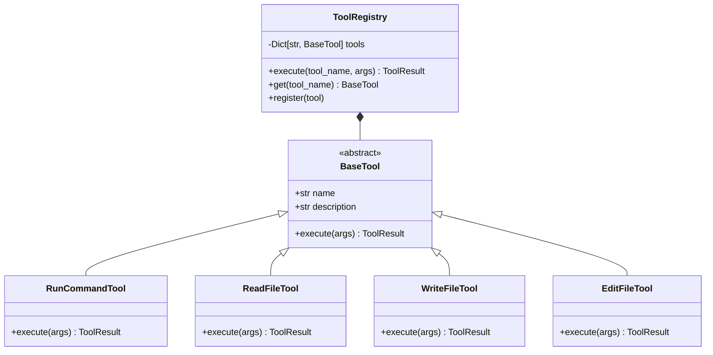
```mermaid
classDiagram
    class ToolRegistry {
        -Dict[str, BaseTool] tools
        +execute(tool_name, args) ToolResult
        +get(tool_name) BaseTool
        +register(tool)
    }
    
    class BaseTool {
        <<abstract>>
        +str name
        +str description
        +execute(args) ToolResult
    }
    
    class RunCommandTool {
        +execute(args) ToolResult
    }
    
    class ReadFileTool {
        +execute(args) ToolResult
    }
    
    class WriteFileTool {
        +execute(args) ToolResult
    }
    
    class EditFileTool {
        +execute(args) ToolResult
    }
    
    ToolRegistry *-- BaseTool
    BaseTool <|-- RunCommandTool
    BaseTool <|-- ReadFileTool
    BaseTool <|-- WriteFileTool
    BaseTool <|-- EditFileTool
```

### 8.2 Tool Execution Sequence

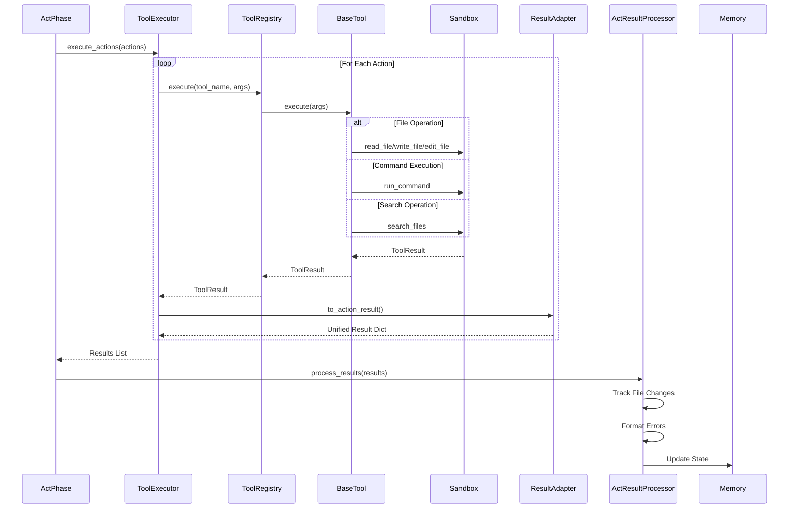
```mermaid
sequenceDiagram
    participant ActPhase
    participant ToolExecutor
    participant ToolRegistry
    participant BaseTool
    participant Sandbox
    participant ResultAdapter
    participant ActResultProcessor
    participant Memory
    
    ActPhase->>ToolExecutor: execute_actions(actions)
    
    loop For Each Action
        ToolExecutor->>ToolRegistry: execute(tool_name, args)
        ToolRegistry->>BaseTool: execute(args)
        
        alt File Operation
            BaseTool->>Sandbox: read_file/write_file/edit_file
        else Command Execution
            BaseTool->>Sandbox: run_command
        else Search Operation
            BaseTool->>Sandbox: search_files
        end
        
        Sandbox-->>BaseTool: ToolResult
        BaseTool-->>ToolRegistry: ToolResult
        ToolRegistry-->>ToolExecutor: ToolResult
        
        ToolExecutor->>ResultAdapter: to_action_result()
        ResultAdapter-->>ToolExecutor: Unified Result Dict
    end
    
    ToolExecutor-->>ActPhase: Results List
    
    ActPhase->>ActResultProcessor: process_results(results)
    ActResultProcessor->>ActResultProcessor: Track File Changes
    ActResultProcessor->>ActResultProcessor: Format Errors
    ActResultProcessor->>Memory: Update State
```

---

## 9. Error Handling Flow

### 9.1 Error Classification and Recovery

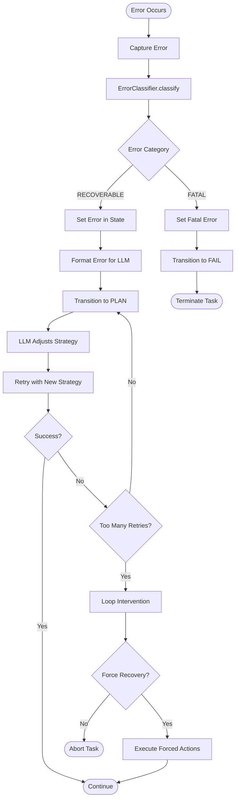
```mermaid
graph TB
    START([Error Occurs]) --> CAPTURE[Capture Error]
    CAPTURE --> CLASSIFY[ErrorClassifier.classify]
    
    CLASSIFY --> CATEGORY{Error Category}
    CATEGORY -->|RECOVERABLE| SET_STATE[Set Error in State]
    CATEGORY -->|FATAL| FAIL_STATE[Set Fatal Error]
    
    SET_STATE --> FORMAT_ERROR[Format Error for LLM]
    FORMAT_ERROR --> TRANSITION_PLAN[Transition to PLAN]
    TRANSITION_PLAN --> LLM_RECOVERY[LLM Adjusts Strategy]
    
    FAIL_STATE --> TRANSITION_FAIL[Transition to FAIL]
    TRANSITION_FAIL --> TERMINATE([Terminate Task])
    
    LLM_RECOVERY --> RETRY[Retry with New Strategy]
    RETRY --> SUCCESS{Success?}
    SUCCESS -->|Yes| CONTINUE([Continue])
    SUCCESS -->|No| LOOP_CHECK{Too Many Retries?}
    
    LOOP_CHECK -->|Yes| INTERVENTION[Loop Intervention]
    LOOP_CHECK -->|No| TRANSITION_PLAN
    
    INTERVENTION --> FORCE_RECOVERY{Force Recovery?}
    FORCE_RECOVERY -->|Yes| EXECUTE_FORCED[Execute Forced Actions]
    FORCE_RECOVERY -->|No| ABORT([Abort Task])
    EXECUTE_FORCED --> CONTINUE
```

### 9.2 Error State Management

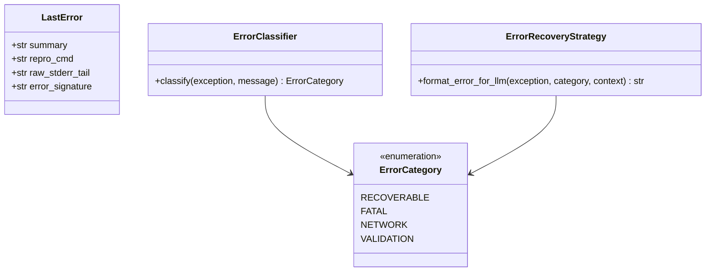
```mermaid
classDiagram
    class LastError {
        +str summary
        +str repro_cmd
        +str raw_stderr_tail
        +str error_signature
    }
    
    class ErrorClassifier {
        +classify(exception, message) ErrorCategory
    }
    
    class ErrorCategory {
        <<enumeration>>
        RECOVERABLE
        FATAL
        NETWORK
        VALIDATION
    }
    
    class ErrorRecoveryStrategy {
        +format_error_for_llm(exception, category, context) str
    }
    
    ErrorClassifier --> ErrorCategory
    ErrorRecoveryStrategy --> ErrorCategory
```

---

## 10. State Management

### 10.1 State Persistence Flow

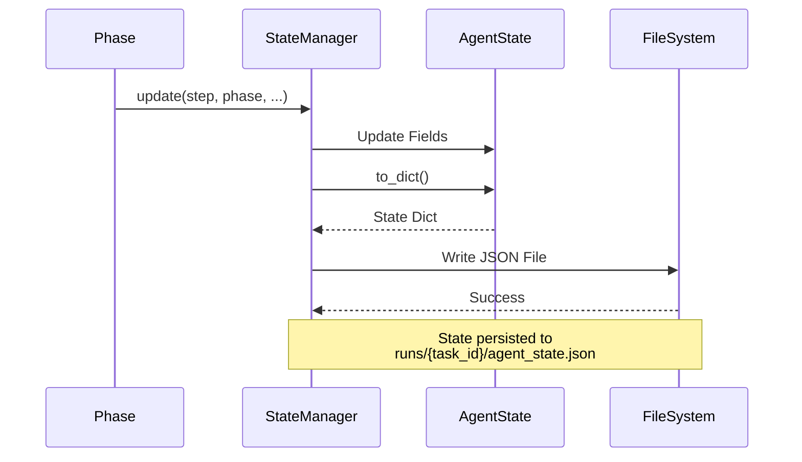
```mermaid
sequenceDiagram
    participant Phase
    participant StateManager
    participant AgentState
    participant FileSystem
    
    Phase->>StateManager: update(step, phase, ...)
    StateManager->>AgentState: Update Fields
    StateManager->>AgentState: to_dict()
    AgentState-->>StateManager: State Dict
    StateManager->>FileSystem: Write JSON File
    FileSystem-->>StateManager: Success
    
    Note over StateManager,FileSystem: State persisted to<br/>runs/{task_id}/agent_state.json
```

### 10.2 State Restoration Flow

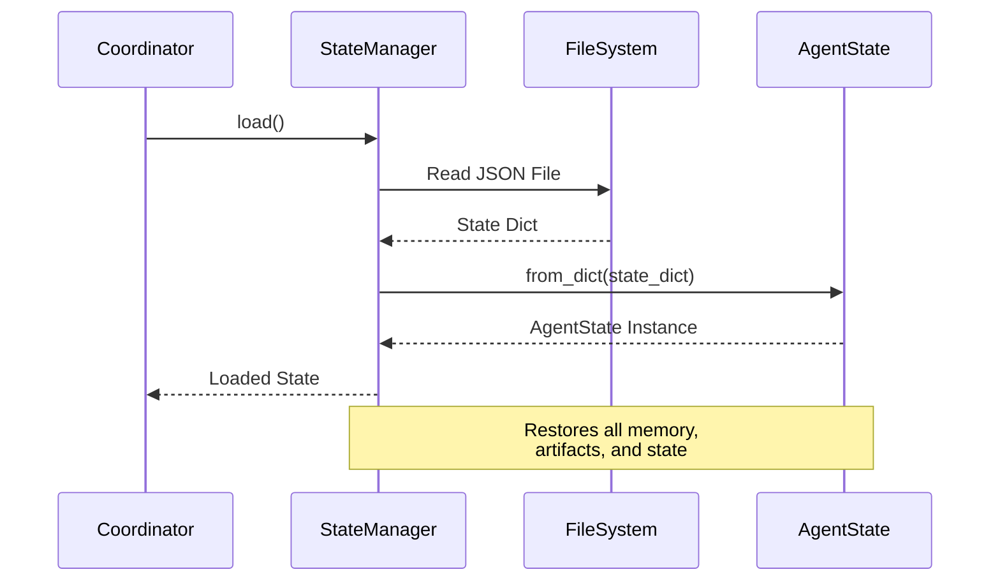
```mermaid
sequenceDiagram
    participant Coordinator
    participant StateManager
    participant FileSystem
    participant AgentState
    
    Coordinator->>StateManager: load()
    StateManager->>FileSystem: Read JSON File
    FileSystem-->>StateManager: State Dict
    StateManager->>AgentState: from_dict(state_dict)
    AgentState-->>StateManager: AgentState Instance
    StateManager-->>Coordinator: Loaded State
    
    Note over StateManager,AgentState: Restores all memory,<br/>artifacts, and state
```

---

## 11. Component Interaction Summary

### 11.1 Key Relationships

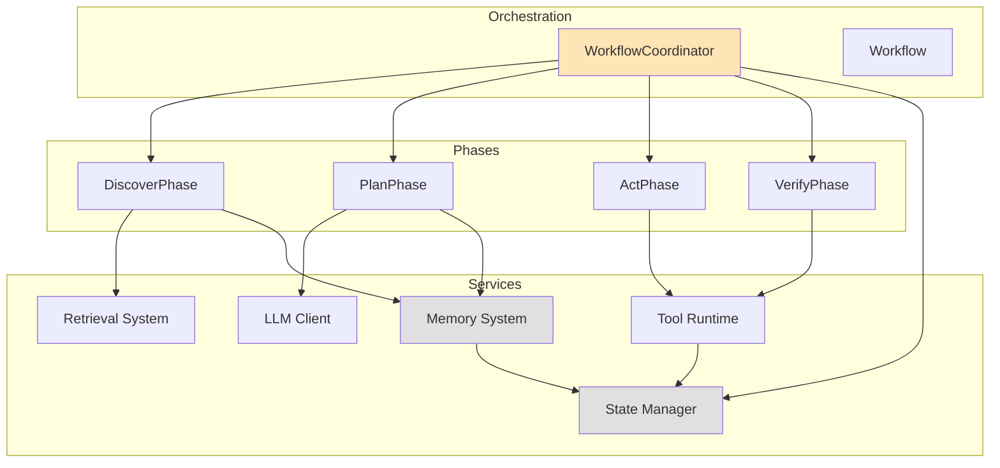
```mermaid
graph TB
    subgraph "Orchestration"
        COORD[WorkflowCoordinator]
        WF[Workflow]
    end
    
    subgraph "Phases"
        DP[DiscoverPhase]
        PP[PlanPhase]
        AP[ActPhase]
        VP[VerifyPhase]
    end
    
    subgraph "Services"
        LLM[LLM Client]
        MEM[Memory System]
        RET[Retrieval System]
        TOOL[Tool Runtime]
        STATE[State Manager]
    end
    
    COORD --> DP
    COORD --> PP
    COORD --> AP
    COORD --> VP
    COORD --> STATE
    
    DP --> RET
    DP --> MEM
    PP --> LLM
    PP --> MEM
    AP --> TOOL
    VP --> TOOL
    
    MEM --> STATE
    TOOL --> STATE
    
    style COORD fill:#FFE4B5
    style MEM fill:#E0E0E0
    style STATE fill:#E0E0E0
```

### 11.2 Data Flow Summary

1. **Context Flow**: Memory → Formatter → ContextPack → LLM
2. **Action Flow**: LLM → PlanPhase → ActPhase → ToolExecutor → Tools
3. **Result Flow**: Tools → ResultAdapter → ActPhase → Memory → State
4. **State Flow**: Phases → StateManager → FileSystem (persistence)

---

## 12. Key Design Decisions

### 12.1 Why Separate Memory and Context Pack?

**Decision**: Memory system handles data storage/formatting, ContextPack handles prompt assembly.

**Rationale**:
- **Separation of Concerns**: Memory doesn't know about prompts
- **Flexibility**: Can build context packs from different sources
- **Testability**: Each component can be tested independently

**Trade-offs**:
- ⚠️ Memory summary is a large string (memory-intensive)
- ⚠️ No caching - memory is reformatted every time
- ✓ Clear boundaries and responsibilities

### 12.2 Why Phase-Based Architecture?

**Decision**: Use explicit phases (DISCOVER, PLAN, ACT, VERIFY) instead of free-form execution.

**Rationale**:
- **Predictability**: Clear execution flow
- **Debugging**: Easy to understand what phase is executing
- **Error Recovery**: Can recover at phase boundaries
- **State Machine**: Enforces valid transitions

**Trade-offs**:
- ⚠️ Less flexible than free-form execution
- ✓ More reliable and easier to reason about

### 12.3 Why State Persistence?

**Decision**: Persist all state to disk after each step.

**Rationale**:
- **Resumability**: Can resume interrupted tasks
- **Debugging**: Can inspect state at any point
- **Audit Trail**: Complete history of execution
- **Recovery**: Can recover from crashes

**Trade-offs**:
- ⚠️ I/O overhead (mitigated by async writes)
- ✓ Critical for production reliability

---

## 13. Extension Points

### 13.1 Adding New Phases

1. Create new phase class inheriting from `BasePhase`
2. Implement `execute()` method
3. Add phase to `Phase` enum
4. Update state machine transitions
5. Register in `Workflow._execute_phase()`

### 13.2 Adding New Tools

1. Create tool class inheriting from `BaseTool`
2. Implement `execute()` method
3. Register in `ToolRegistry` (auto-discovery or manual)
4. Add to tool schema in `LLMClient.generate_tool_schema()`

### 13.3 Custom Memory Formatting

1. Extend `MemoryFormatter` class
2. Override `format()` method
3. Use custom formatter in `Memory.get_formatted_context()`

---

## 14. Performance Considerations

### 14.1 Memory Formatting

- **Issue**: Memory is reformatted every time
- **Impact**: CPU and memory usage
- **Solution**: Add caching with invalidation on state changes

### 14.2 Search Operations

- **Issue**: File search can be slow
- **Impact**: DISCOVER phase latency
- **Solution**: Cache search results, use incremental indexing

### 14.3 State Persistence

- **Issue**: Writing state after each step
- **Impact**: I/O overhead
- **Solution**: Async writes, batch updates

---

## 15. Security Considerations

### 15.1 Sandbox Isolation

- All tool execution happens in isolated sandbox
- No direct file system access
- Sandbox adapter provides security boundary

### 15.2 Input Validation

- ActionJSON validation prevents malformed actions
- Tool argument validation
- State validation on load

### 15.3 Error Information

- Error information is sanitized before logging
- Sensitive data should not be in error messages
- State files should be protected

---

This architecture documentation provides a comprehensive view of the atloop system. For implementation details, refer to the source code and API documentation.
