# Atloop 循环检测与内存架构详细文档

> **版本**: 2.0 (改进后)  
> **日期**: 2025-01-11  
> **作者**: AI System Design

## 目录

1. [概述](#概述)
2. [核心问题与解决方案](#核心问题与解决方案)
3. [架构总览](#架构总览)
4. [Memory 内存系统](#memory-内存系统)
5. [Progress Tracker 进度追踪器](#progress-tracker-进度追踪器)
6. [Loop Detector 循环检测器](#loop-detector-循环检测器)
7. [干预等级与策略](#干预等级与策略)
8. [Phase 流程集成](#phase-流程集成)
9. [配置参数](#配置参数)
10. [完整流程图](#完整流程图)

---

## 概述

Atloop 是一个基于 LLM 的自动化任务执行系统，它使用 Agent 循环来完成复杂任务。本文档详细描述了系统中的 **内存管理**、**进度追踪** 和 **循环检测** 机制。

### 核心设计原则

```
┌─────────────────────────────────────────────────────────────────┐
│                       设计原则                                   │
├─────────────────────────────────────────────────────────────────┤
│ 1. 事实与假设分离 - Facts 用于 LLM 输入，Hypotheses 仅用于调试   │
│ 2. 证据驱动决策 - LLM 必须基于工具执行结果做决策，而非猜测       │
│ 3. 渐进式干预 - 从软警告到强制策略，逐步升级                     │
│ 4. 客观可量化 - 进度指标必须是客观、可测量的                     │
└─────────────────────────────────────────────────────────────────┘
```

---

## 核心问题与解决方案

### 问题描述

在之前的版本中，系统存在一个严重的**反馈循环问题**：


**具体表现**：
- LLM 声称文件有 "语法错误" (实际没有)
- 该声明被存储在 `thought_summary` 中
- 下一轮 `thought_summary` 被反馈给 LLM
- LLM 看到 "语法错误" 的说法，认为这是事实
- 继续坚持修复不存在的错误
- 陷入无限循环

### 解决方案架构

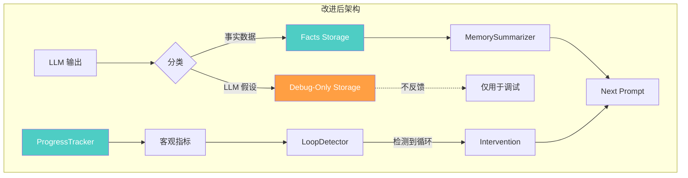

---

## 架构总览

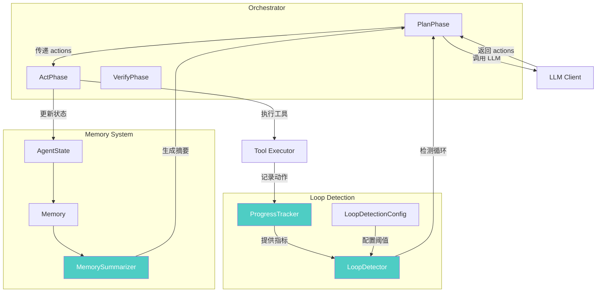

---

## Memory 内存系统

### Memory 数据结构

Memory 被设计为三个清晰分离的类别：

```python
@dataclass
class Memory:
    """Memory for tracking decisions and attempts."""
    
    # =========================================================================
    # FACTS - 客观数据 (反馈给 LLM)
    # =========================================================================
    created_files: List[str]              # 已创建的文件
    attempts: List[Dict[str, Any]]        # 工具执行尝试
    key_files: List[Dict[str, Any]]       # 关键文件
    notes: List[str]                      # 事实性备注
    tool_results_history: List[Dict]      # 工具执行结果历史
    modified_files_content: List[Dict]    # 修改后的文件内容
    
    # =========================================================================
    # PROGRESS TRACKING - 进度追踪 (仅指标反馈给 LLM)
    # =========================================================================
    action_history: List[Dict[str, Any]]  # 动作历史 (用于持久化)
    
    # =========================================================================
    # LONG-TERM MEMORY - 长期记忆 (反馈给 LLM)
    # =========================================================================
    plan: Union[str, List[Any]]           # 当前计划
    task_summary: str                     # 任务摘要
    important_decisions: List[Dict]       # 重要决策
    milestones: List[Dict]                # 里程碑
    learnings: List[str]                  # 学习经验
    
    # =========================================================================
    # DEBUG-ONLY - LLM 解释 (不反馈给 LLM，防止循环)
    # =========================================================================
    decisions: List[Dict[str, Any]]       # 包含 thought_summary
    llm_responses: List[Dict[str, Any]]   # 完整 LLM 响应
```

### Memory 分类流程

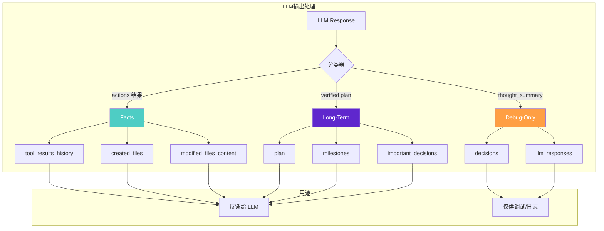

### MemorySummarizer 工作原理

MemorySummarizer 负责将 Memory 转换为 LLM 可消费的文本摘要：

**关键改进**：

```python
# ❌ 旧代码 - 会造成反馈循环
if state.memory.decisions:
    for decision in state.memory.decisions[-3:]:
        thought_summary = decision.get("thought_summary", "")
        if thought_summary:
            parts.append(f"- Step {step}: {thought_summary}")  # 危险！

# ✅ 新代码 - 仅显示事实
if state.memory.decisions:
    parts.append("## Recent Steps (Facts Only)")
    for decision in state.memory.decisions[-3:]:
        step = decision.get("step", "?")
        actions = decision.get("actions", [])
        # 只显示工具调用信息，不显示 thought_summary
        tools_used = [a.get("tool", "?") for a in actions[:3]]
        parts.append(f"- Step {step}: {len(actions)} actions [{', '.join(tools_used)}]")
```

---

## Progress Tracker 进度追踪器

### 核心概念

ProgressTracker 追踪**客观、可量化**的执行进度指标：

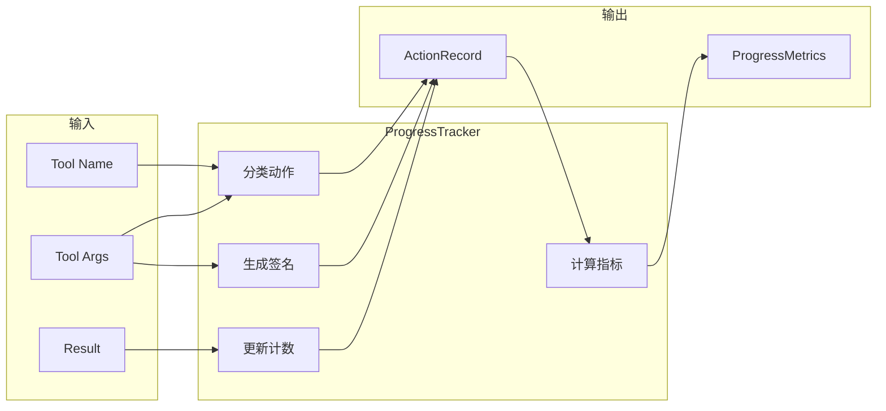

### 动作分类 (ActionCategory)

```python
class ActionCategory(Enum):
    VIEW = "view"       # 查看操作: cat, head, grep, ls
    MODIFY = "modify"   # 修改操作: write_file, edit_file
    EXECUTE = "execute" # 执行操作: python, node, pytest
    EXPLORE = "explore" # 探索操作: find, pwd, which
    OTHER = "other"     # 其他操作
```

### 动作签名生成

动作签名用于比较两个动作是否 "相同"：

```python
def _generate_signature(self, tool: str, args: Dict[str, Any]) -> str:
    """生成规范化的动作签名"""
    normalized = {"tool": tool}
    
    if tool == "run":
        # 规范化命令: cat file.txt → cat <PATH>.txt
        normalized["cmd_template"] = self._normalize_command(cmd)
    elif tool in ["write_file", "edit_file"]:
        # 文件操作: 记录路径，不记录内容
        normalized["path"] = args.get("path", "")
    
    # 生成 MD5 哈希
    return hashlib.md5(str(sorted(normalized.items())).encode()).hexdigest()
```

**签名规范化示例**：

| 原始命令 | 规范化后 | 签名 |
|----------|----------|------|
| `cat /workspace/test.js` | `cat <PATH>.js` | `abc123...` |
| `cat /workspace/test.js` | `cat <PATH>.js` | `abc123...` (相同) |
| `head -n 10 /workspace/test.js` | `head -n <NUM> <PATH>.js` | `def456...` |

### 进度指标 (ProgressMetrics)

```python
@dataclass
class ProgressMetrics:
    # 文件操作统计
    files_created: int = 0
    files_modified: int = 0
    
    # 动作类别统计
    view_actions: int = 0
    modify_actions: int = 0
    execute_actions: int = 0
    
    # 重复检测
    total_actions: int = 0
    unique_actions: int = 0        # 唯一签名数
    repeated_actions: int = 0      # 重复次数
    
    # 比率指标
    view_to_modify_ratio: float    # 高 = "查看但不修复"
    repetition_rate: float         # 高 = 陷入循环
    
    # 连续模式
    consecutive_view_count: int    # 连续查看次数
    consecutive_same_pattern: int  # 连续相同动作次数
```

### 完整追踪流程

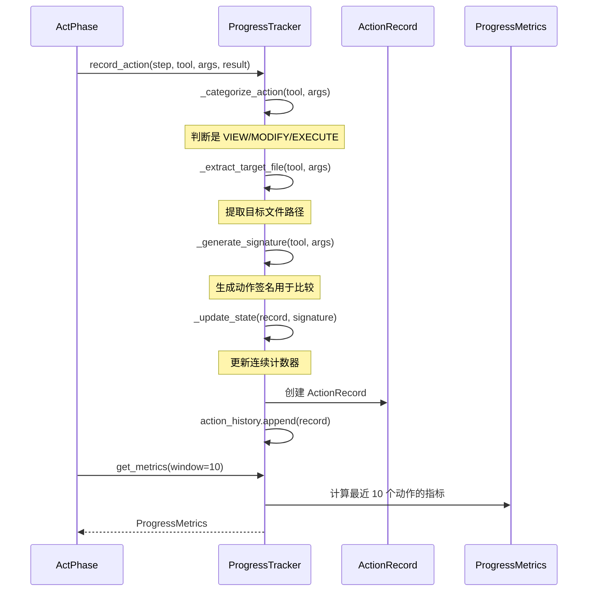

---

## Loop Detector 循环检测器

### 循环类型

```python
class LoopType(Enum):
    NONE = "none"                          # 无循环
    VIEW_WITHOUT_MODIFY = "view_without_modify"  # 查看但不修改
    SAME_ACTION_REPEAT = "same_action_repeat"    # 相同动作重复
    NO_PROGRESS = "no_progress"                  # 无进展
    EXPLORATION_LOOP = "exploration_loop"        # 探索循环
```

### 检测逻辑

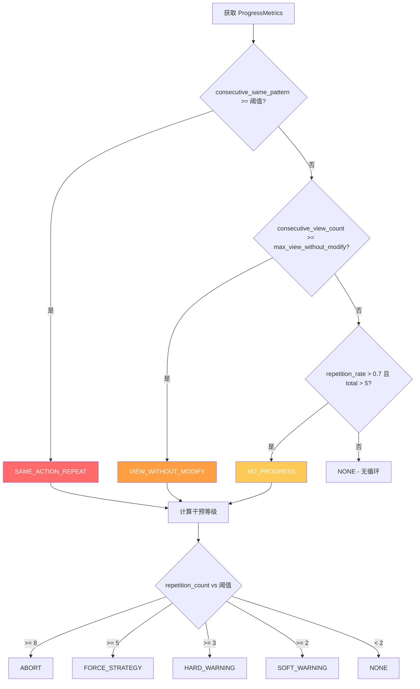

### 循环分析结果

```python
@dataclass
class LoopAnalysis:
    is_looping: bool                    # 是否检测到循环
    loop_type: LoopType                 # 循环类型
    intervention_level: InterventionLevel  # 干预等级
    repetition_count: int               # 重复次数
    evidence: List[str]                 # 证据列表
    suggested_action: Optional[str]     # 建议动作
    metrics: Optional[ProgressMetrics]  # 指标数据
```

---

## 干预等级与策略

### 干预等级定义

```python
class InterventionLevel(IntEnum):
    NONE = 0           # 正常运行
    SOFT_WARNING = 1   # 软警告
    HARD_WARNING = 2   # 硬警告
    FORCE_STRATEGY = 3 # 强制恢复策略
    ABORT = 4          # 中止当前方向
```

### 阈值配置

| 干预等级 | 默认阈值 | 触发条件 |
|----------|----------|----------|
| SOFT_WARNING | 2 次 | 同一动作重复 2 次 |
| HARD_WARNING | 3 次 | 同一动作重复 3 次 |
| FORCE_STRATEGY | 5 次 | 同一动作重复 5 次 |
| ABORT | 8 次 | 同一动作重复 8 次 |

### 干预策略详解

#### 1. SOFT_WARNING (软警告)

```
## ⚠️ Pattern Warning

The system has detected a potentially unproductive pattern:
  - Same action pattern repeated 2 times

**Suggestion**: Try a different approach

Please consider changing your approach if you're not making progress.
```

#### 2. HARD_WARNING (硬警告)

```
## 🚨🚨🚨 CRITICAL: LOOP DETECTED - IMMEDIATE ACTION REQUIRED 🚨🚨🚨

**STOP!** You are stuck in a repetitive loop that is NOT making progress.

**Evidence:**
  - Same action pattern repeated 3 times: [cat file.txt, cat file.txt, cat file.txt]

**MANDATORY ACTION:**
You MUST do something DIFFERENT from your recent actions

**Rules:**
1. Do NOT repeat the same viewing/checking commands
2. If you've seen the file content, DO NOT view it again
3. Either MODIFY the file or EXECUTE it to get real results
4. If you claim there's an error, you MUST run the code to prove it

**If you output the same actions again, the system will FORCE a different strategy.**
```

#### 3. FORCE_STRATEGY (强制策略)

```
## 🛑🛑🛑 SYSTEM OVERRIDE: FORCED RECOVERY 🛑🛑🛑

**The system is taking control because you are stuck in an unbreakable loop.**

**Loop Evidence (5 repetitions):**
  - Same action pattern repeated 5 times

**SYSTEM WILL NOW FORCE THE FOLLOWING ACTIONS:**
  1. run: {'cmd': "find /workspace -name '*.js' | head -10"}
     Reason: Find executable files

**Your claims about "syntax errors" or other issues are NOT verified.**
**The system will now EXECUTE the code to get ACTUAL results.**
```

#### 4. ABORT (中止)

```
## ⛔⛔⛔ SYSTEM ABORT: STRATEGY FAILED ⛔⛔⛔

**After 8 attempts, the current approach has completely failed.**

**The system is ABORTING this approach.**

**YOU MUST:**
1. Completely ABANDON your current line of thinking
2. Start with a FRESH approach
3. If the file exists and seems complete, consider that the task might be DONE
4. Use stop_reason="done" if the original goal appears achieved
```

### 干预策略可视化

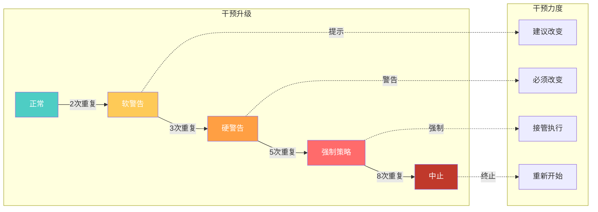

---

## Phase 流程集成

### PlanPhase 集成

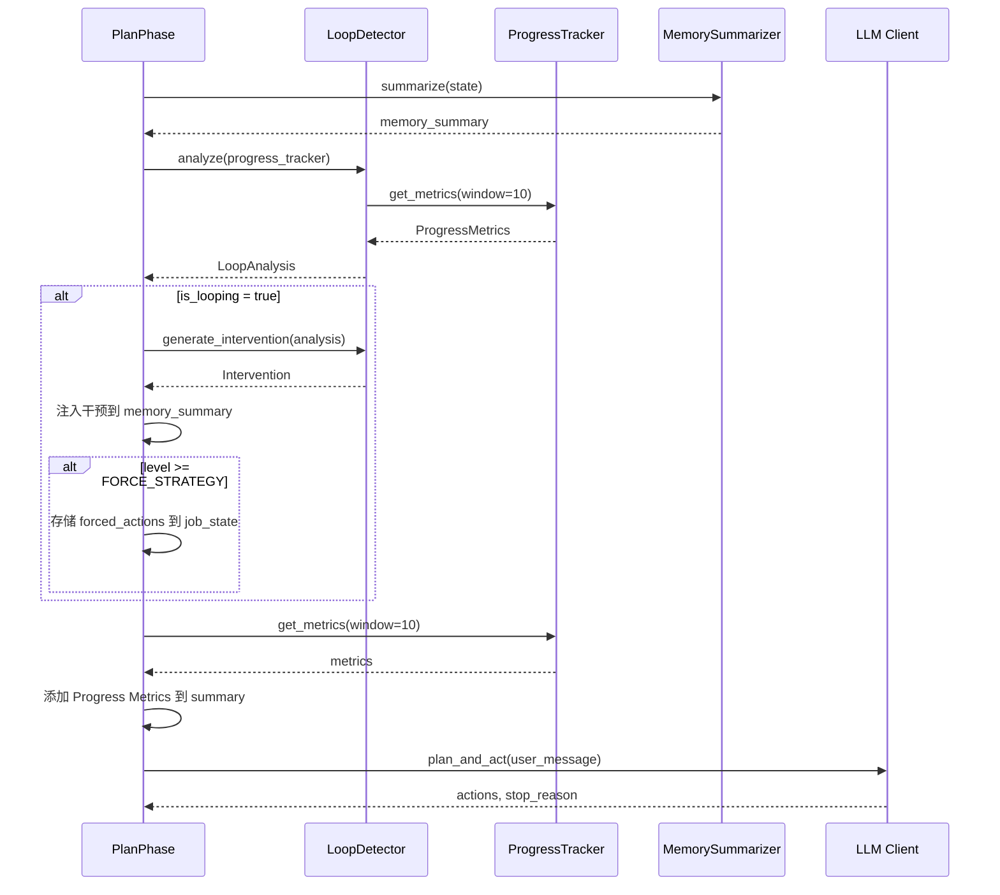

### ActPhase 集成

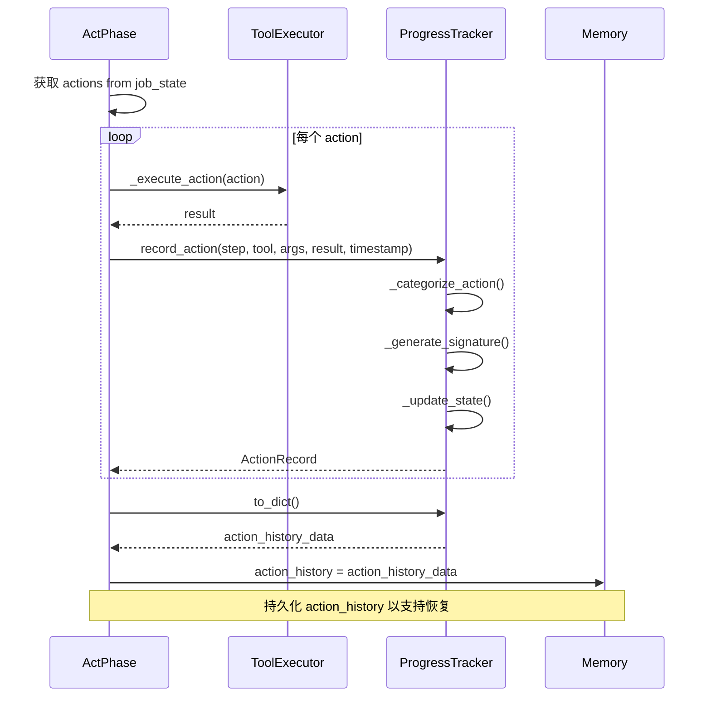

### 完整执行流程

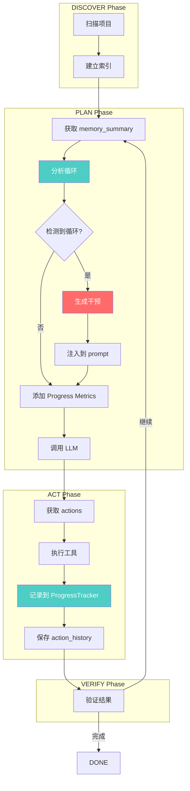

---

## 配置参数

### LoopDetectionConfig

```python
@dataclass
class LoopDetectionConfig:
    # === 重复阈值 ===
    soft_warning_threshold: int = 2   # 软警告阈值
    hard_warning_threshold: int = 3   # 硬警告阈值
    force_threshold: int = 5          # 强制策略阈值
    abort_threshold: int = 8          # 中止阈值
    
    # === 模式检测 ===
    pattern_window_size: int = 10     # 检测窗口大小
    action_similarity_threshold: float = 0.8  # 相似度阈值
    
    # === 查看而不修复检测 ===
    max_view_without_modify: int = 3  # 最大连续查看次数
    
    view_commands: List[str] = [
        "cat", "head", "tail", "less", "more", "grep", "find", "ls", "wc"
    ]
    
    modify_tools: List[str] = [
        "write_file", "edit_file", "append_file", "multi_edit_file"
    ]
    
    # === 恢复策略 ===
    recovery_strategies: List[str] = [
        "execute_to_verify",  # 执行代码验证
        "change_approach",    # 改变方法
        "simplify_task",      # 简化任务
    ]
    
    # === 进度指标权重 ===
    weight_files_created: float = 3.0
    weight_files_modified: float = 2.0
    weight_commands_executed: float = 0.5
    weight_unique_actions: float = 1.0
```

### 自定义配置示例

```python
# 严格配置 - 快速检测循环
strict_config = LoopDetectionConfig(
    soft_warning_threshold=1,
    hard_warning_threshold=2,
    force_threshold=3,
    abort_threshold=4,
    max_view_without_modify=2,
)

# 宽松配置 - 允许更多探索
lenient_config = LoopDetectionConfig(
    soft_warning_threshold=5,
    hard_warning_threshold=8,
    force_threshold=12,
    abort_threshold=15,
    max_view_without_modify=5,
)
```

---

## 完整流程图

### 系统架构总览

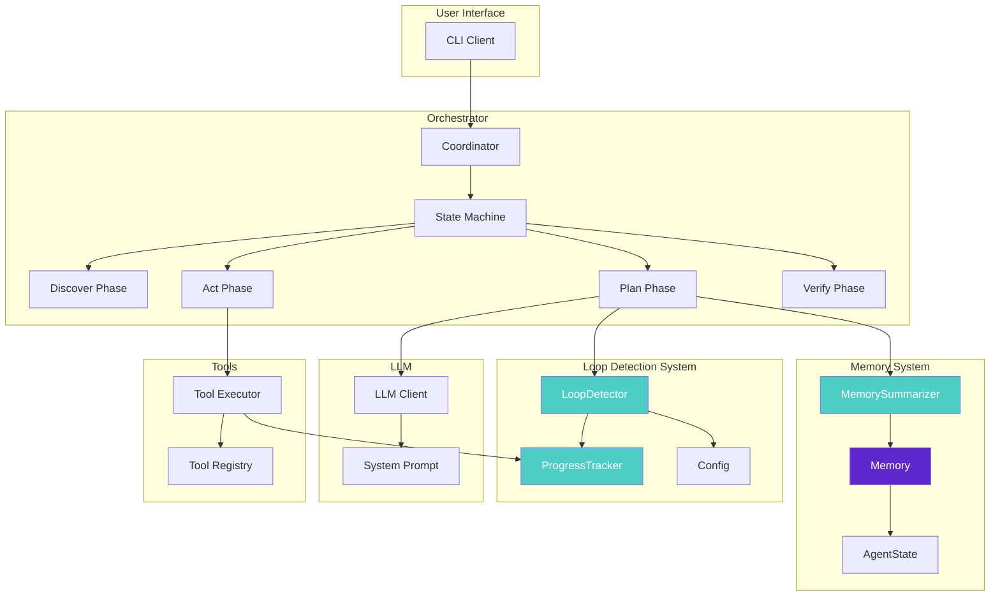

### 数据流向

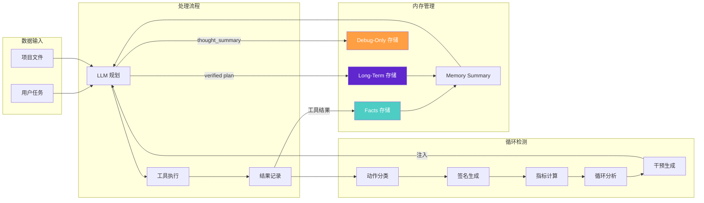

---

## 最佳实践

### 1. 防止反馈循环

```python
# ❌ 错误做法
memory_summary += f"LLM thinks: {thought_summary}"  # 会造成循环

# ✅ 正确做法
memory_summary += f"Tools called: {tools_used}"     # 仅报告事实
```

### 2. 证据驱动决策

```
❌ 错误: "文件有语法错误" (未执行代码验证)
✅ 正确: "执行 node test.js 得到错误: SyntaxError at line 5"
```

### 3. 渐进式干预

```python
# 根据严重程度选择干预
if repetition_count >= 8:
    return abort_and_restart()
elif repetition_count >= 5:
    return force_recovery_actions()
elif repetition_count >= 3:
    return inject_hard_warning()
elif repetition_count >= 2:
    return inject_soft_warning()
else:
    return continue_normal()
```

### 4. 持久化支持

```python
# 保存状态以支持恢复
state.memory.action_history = [
    a.to_dict() for a in progress_tracker.action_history
]

# 从保存状态恢复
progress_tracker = ProgressTracker.from_dict({
    "action_history": state.memory.action_history,
    "created_files": list(state.memory.created_files),
})
```

---

## 总结

改进后的架构通过以下机制有效解决了 LLM 陷入循环的问题：

| 机制 | 作用 |
|------|------|
| **事实/假设分离** | 防止 LLM 的错误假设被反馈放大 |
| **ProgressTracker** | 客观追踪执行进度，提供可量化指标 |
| **LoopDetector** | 基于证据检测循环，而非启发式规则 |
| **渐进式干预** | 从软警告到强制策略，逐步升级响应 |
| **证据驱动提示** | 强制 LLM 基于工具执行结果做决策 |

这些机制共同确保了系统能够可靠地检测和打破执行循环，同时保持对任务目标的追踪。
