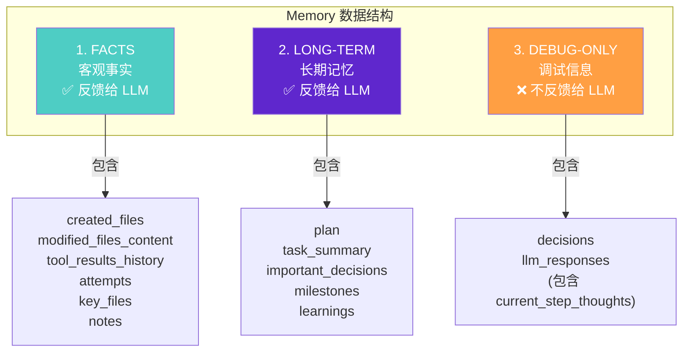
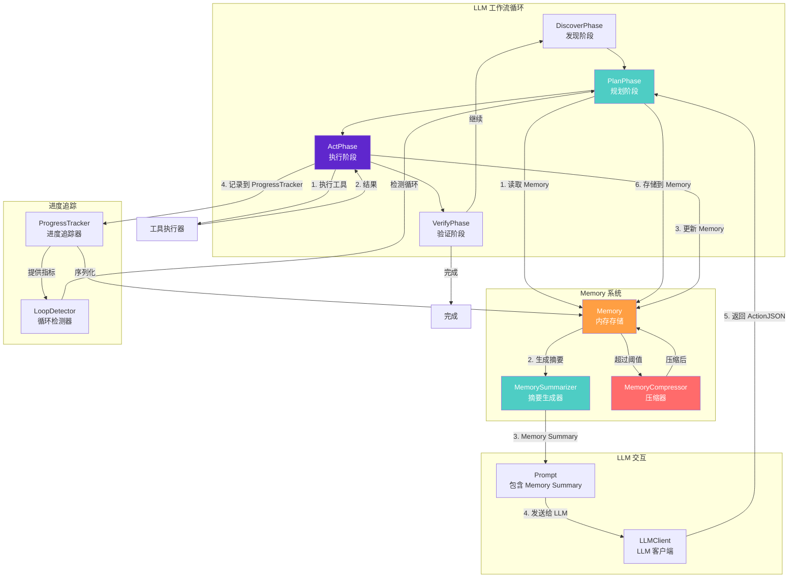
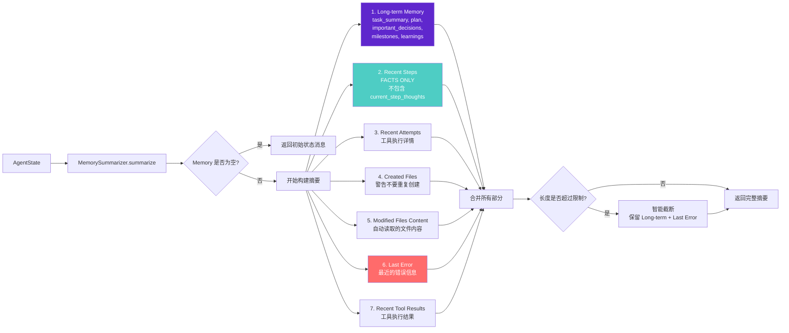
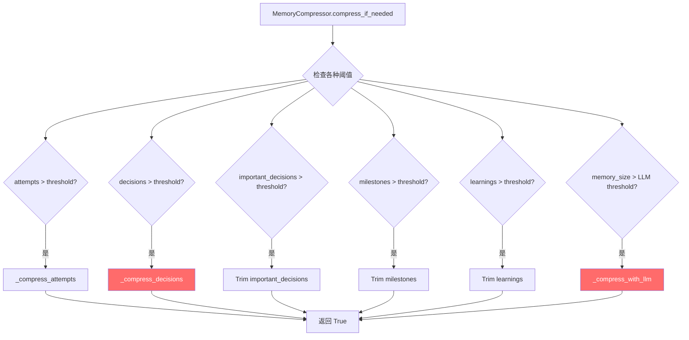
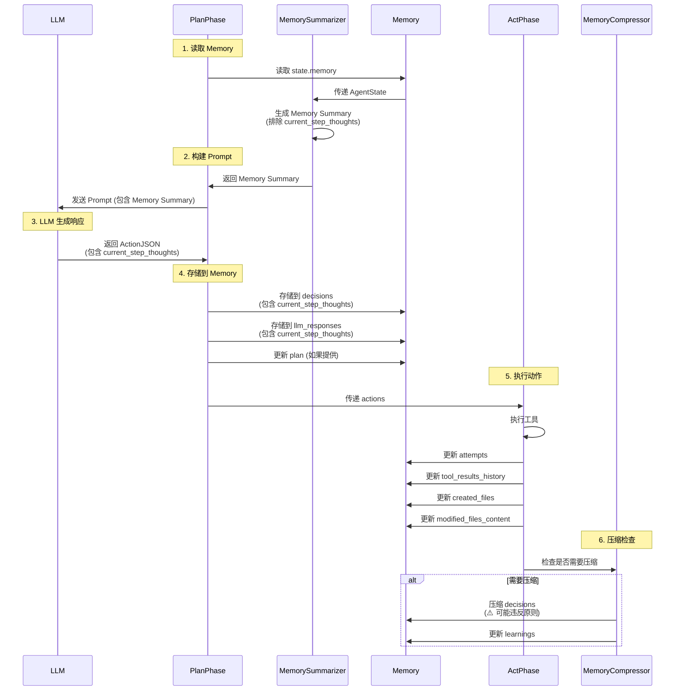
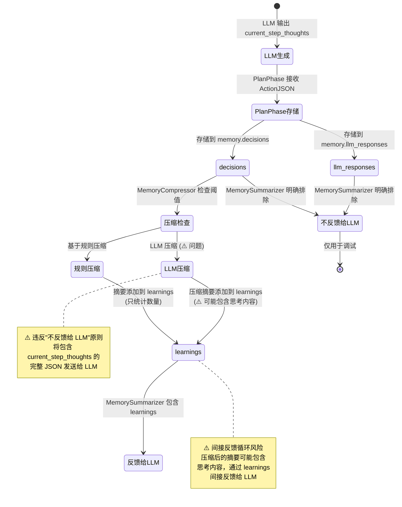
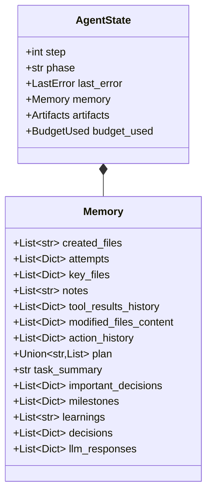
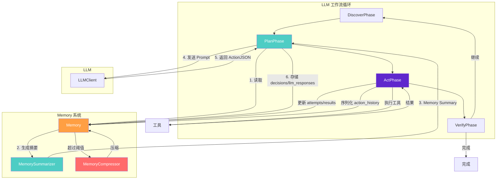

# Memory 设计与数据流转详细分析

## 执行摘要

本报告详细分析了 atloop 系统中 Memory 的设计架构、字段分类、与 LLM 工作流的交互机制，以及完整的数据流转过程。结合 `current_step_thoughts` 的生命周期分析，提供了系统性的理解。

---

## 1. Memory 设计架构

### 1.1 三层分类体系

Memory 被设计为三个清晰分离的类别，每个类别有不同的用途和反馈策略：



### 1.2 字段详细说明

#### 类别 1: FACTS (客观事实) - 反馈给 LLM

| 字段 | 类型 | 用途 | 更新时机 |
|------|------|------|----------|
| `created_files` | `List[str]` | 跟踪已创建的文件，防止重复创建 | ActPhase: 文件创建时 |
| `modified_files_content` | `List[Dict]` | 自动读取修改后的文件内容 | ActPhase: 文件修改后 |
| `tool_results_history` | `List[Dict]` | 工具执行结果历史 | ActPhase: 每次工具执行后 |
| `attempts` | `List[Dict]` | 工具执行尝试记录（包含结果） | ActPhase: 每次执行后 |
| `key_files` | `List[Dict]` | 识别出的关键文件 | DiscoverPhase/PlanPhase |
| `notes` | `List[str]` | 事实性笔记 | 任意阶段 |

**特点**：
- ✅ 都是**客观、可验证**的事实
- ✅ 全部反馈给 LLM，作为决策依据
- ✅ 不包含 LLM 的主观解释

#### 类别 2: LONG-TERM (长期记忆) - 反馈给 LLM

| 字段 | 类型 | 用途 | 更新时机 |
|------|------|------|----------|
| `plan` | `Union[str, List]` | 当前执行计划（可动态更新） | PlanPhase: LLM 输出 plan 时 |
| `task_summary` | `str` | 任务目标和约束摘要 | 任务开始时 |
| `important_decisions` | `List[Dict]` | 重要决策列表（按重要性排序） | 手动添加或自动检测 |
| `milestones` | `List[Dict]` | 已达成里程碑 | ActPhase: 自动检测（修改≥3个文件） |
| `learnings` | `List[str]` | 重要经验总结 | MemoryCompressor: 压缩时生成 |

**特点**：
- ✅ 经过**验证/确认**的信息
- ✅ 全部反馈给 LLM，提供长期上下文
- ✅ 可以动态更新（如 plan）

#### 类别 3: DEBUG-ONLY (调试信息) - 不反馈给 LLM

| 字段 | 类型 | 用途 | 更新时机 |
|------|------|------|----------|
| `decisions` | `List[Dict]` | 决策记录（包含 current_step_thoughts） | PlanPhase: 每次 LLM 调用后 |
| `llm_responses` | `List[Dict]` | LLM 完整回复（包含 current_step_thoughts） | PlanPhase: 每次 LLM 调用后 |

**特点**：
- ❌ **不反馈给 LLM**（防止反馈循环）
- 📝 仅用于调试、日志、分析
- ⚠️ 包含 `current_step_thoughts`（LLM 的主观思考）

#### 特殊字段: PROGRESS TRACKING

| 字段 | 类型 | 用途 | 更新时机 |
|------|------|------|----------|
| `action_history` | `List[Dict]` | 动作历史（用于循环检测） | ActPhase: 每次动作执行后 |

**特点**：
- 🔄 从 `ProgressTracker` 序列化而来
- 📊 反馈给 LLM 时只显示**指标**（不显示具体思考）

---

## 2. Memory 与 LLM 工作流交互

### 2.1 完整工作流图



### 2.2 各阶段详细交互

#### DiscoverPhase (发现阶段)

**与 Memory 的交互**：
- 📖 **读取**：`memory.key_files`（已识别的关键文件）
- 📝 **更新**：`memory.key_files`（新发现的关键文件）

**数据流**：
```
DiscoverPhase → 分析工作区 → 识别关键文件 → 更新 memory.key_files
```

#### PlanPhase (规划阶段) - 核心交互点

**与 Memory 的交互**：

1. **读取 Memory**：
   ```python
   memory_summary = MemorySummarizer.summarize(
       state,
       max_length=memory_summary_max_length,
       task_goal=task_spec.goal,
   )
   ```

2. **生成 Prompt**：
   ```python
   user_message = llm_client.build_user_message(
       goal=task_spec.goal,
       state_summary=memory_summary,  # ← Memory Summary 在这里
       ...
   )
   ```

3. **调用 LLM**：
   ```python
   action_json, error, usage, full_output, file_contents = (
       llm_client.plan_and_act(user_message)
   )
   ```

4. **存储到 Memory**：
   ```python
   # 存储到 decisions
   decision_record = {
       "step": state.step,
       "current_step_thoughts": action_json.current_step_thoughts,  # ← 存储
       "plan": action_json.plan,
       "actions": [...],
       ...
   }
   state.memory.decisions.append(decision_record)
   
   # 存储到 llm_responses
   llm_response_record = {
       "step": state.step,
       "current_step_thoughts": action_json.current_step_thoughts,  # ← 存储
       ...
   }
   state.memory.llm_responses.append(llm_response_record)
   
   # 更新 plan（如果 LLM 提供了新计划）
   if action_json.plan:
       state.memory.plan = action_json.plan
   ```

**数据流**：
```
PlanPhase → 读取 Memory → 生成 Summary → 构建 Prompt → 调用 LLM
    ↓
LLM 返回 ActionJSON (包含 current_step_thoughts)
    ↓
存储到 memory.decisions 和 memory.llm_responses
    ↓
更新 memory.plan (如果提供)
```

#### ActPhase (执行阶段)

**与 Memory 的交互**：

1. **执行工具**：
   ```python
   result = executor._execute_action(action)
   ```

2. **更新 Memory**：
   ```python
   # 记录 attempt
   state.memory.attempts.append({
       "step": state.step,
       "files": modified_files,
       "success": success,
       "results": results,
   })
   
   # 记录工具结果
   state.memory.tool_results_history.append({
       "step": state.step,
       "tool": tool,
       "args": args,
       "result": result,
   })
   
   # 跟踪文件创建
   if tool == "write_file":
       state.memory.created_files.append(file_path)
   
   # 自动读取修改后的文件内容
   if tool in ["write_file", "edit_file", "append_file"]:
       # 读取文件内容并存储到 modified_files_content
   ```

3. **记录到 ProgressTracker**：
   ```python
   progress_tracker.record_action(
       step=state.step,
       tool=tool,
       args=args,
       result=result,
   )
   ```

4. **序列化 ProgressTracker**：
   ```python
   state.memory.action_history = [
       a.to_dict() for a in progress_tracker.action_history
   ]
   ```

5. **检测里程碑**：
   ```python
   if success and len(modified_files) >= 3:
       MemoryManager.add_milestone(state, milestone_content)
   ```

**数据流**：
```
ActPhase → 执行工具 → 获取结果
    ↓
更新 memory.attempts
更新 memory.tool_results_history
更新 memory.created_files (如果创建文件)
更新 memory.modified_files_content (自动读取)
    ↓
记录到 ProgressTracker
序列化到 memory.action_history
    ↓
检测里程碑 → 更新 memory.milestones
```

#### VerifyPhase (验证阶段)

**与 Memory 的交互**：
- 📊 **读取**：`memory.artifacts.verification_success`
- 📝 **更新**：`memory.artifacts.verification_success`（验证结果）

---

## 3. Memory Summarizer 工作原理

### 3.1 摘要生成流程



### 3.2 摘要内容优先级

`MemorySummarizer.summarize()` 按照以下优先级组织内容：

1. **最高优先级**：Long-term Memory
   - Task Summary
   - Current Plan
   - Important Decisions (Top 5)
   - Milestones (Top 5)
   - Learnings (Top 3)

2. **高优先级**：Recent Steps (FACTS ONLY)
   - 只显示工具调用、动作数量、stop_reason
   - **明确排除** `current_step_thoughts`

3. **中优先级**：Recent Attempts
   - 工具执行详情（stdout, stderr）

4. **中优先级**：Created Files
   - 警告不要重复创建

5. **中优先级**：Modified Files Content
   - 自动读取的文件内容（最多 5 个文件，20KB）

6. **高优先级**：Last Error
   - 最近的错误信息（完整 stderr/stdout）

7. **低优先级**：Recent Tool Results
   - 工具执行结果历史

### 3.3 智能截断策略

当摘要超过 `max_length` 时：

1. **保留**：Long-term Memory（完整保留）
2. **保留**：Last Error（尽可能保留）
3. **截断**：其他部分（按重要性）

---

## 4. Memory Compressor 工作原理

### 4.1 压缩触发条件



### 4.2 压缩策略

#### 策略 1: 基于规则的压缩

**对于 `decisions`**：
```python
def _compress_decisions(state, keep_recent=5):
    recent = state.memory.decisions[-keep_recent:]
    old = state.memory.decisions[:-keep_recent]
    
    # ✅ 改进：提取关键事实信息（不包含思考过程）
    summary = _summarize_decisions(old)  
    # 现在返回："历史 X 个决策，共执行了 Y 个动作。停止原因分布: continue:5, done:3。验证结果: 成功 6 次, 失败 2 次。常用工具: run(8), read_file(5)"
    
    # 添加到 learnings
    learning_entry = f"[Step {state.step}] 历史决策总结: {summary}"
    state.memory.learnings.append(learning_entry)
    
    # 只保留最近的
    state.memory.decisions = recent
```

**改进**：✅ **已修复**
- ✅ `_summarize_decisions` 现在提取关键事实信息（stop_reason 分布、验证结果、常用工具）
- ✅ 不包含任何思考过程内容
- ✅ 生成更有价值的摘要

#### 策略 2: LLM 压缩

**触发条件**：
- `memory_config.llm_compression_enabled == True`
- `memory_size > memory_config.llm_compression_threshold`

**压缩过程**（✅ **已修复**）：
```python
def _compress_with_llm(state, memory_config, llm_client):
    old_decisions = state.memory.decisions[:-10]  # 保留最近 10 个
    recent_decisions = state.memory.decisions[-10:]
    
    # ✅ 改进：过滤掉不应反馈给 LLM 的字段
    filtered_decisions = []
    for decision in old_decisions:
        filtered = {
            "step": decision.get("step"),
            "stop_reason": decision.get("stop_reason"),
            "actions_count": decision.get("actions_count"),
            "verification_success": decision.get("verification_success"),
            "actions": decision.get("actions", []),  # 动作列表是事实
            # ❌ 明确排除：current_step_thoughts, plan, llm_output
        }
        filtered_decisions.append(filtered)
    
    # ✅ 只发送事实信息给 LLM
    decisions_json = json.dumps(filtered_decisions, ...)
    
    compression_prompt = f"""请将以下历史决策压缩为简洁的摘要...
    {decisions_json}  # ← 只包含事实信息，不包含 current_step_thoughts
    ⚠️ **重要**：只提取事实信息，不要包含任何 LLM 的思考过程
    """
    
    compressed_summary = llm_client.chat.complete(
        compression_prompt,
        system="只处理事实信息，不包含 LLM 的思考过程",
        ...
    )
    
    # 创建压缩记录
    compressed_record = {
        "type": "llm_compressed",
        "summary": compressed_summary,  # ← 只包含事实信息
        ...
    }
    
    # 替换为压缩记录 + 最近的
    state.memory.decisions = [compressed_record] + recent_decisions
```

**修复状态**：✅ **已解决**
- ✅ **严格遵守原则**：过滤掉 `current_step_thoughts`、`plan`、`llm_output` 后再发送给 LLM
- ✅ **消除间接反馈循环风险**：压缩摘要只包含事实信息
- ✅ **在 prompt 中明确要求**：只提取事实信息，不包含思考过程

#### 策略 3: 去重

**去重逻辑**：
```python
def _deduplicate_memory(state, memory_config):
    # 计算决策相似度
    similarity = _calculate_similarity(decision1, decision2)
    
    if similarity >= threshold:
        # 合并相似决策（保留更近的）
        ...
```

**状态**：✅ **已更新**
- ✅ 去重时使用 `current_step_thoughts`（新字段名）计算相似度
- ✅ 保持向后兼容：如果新字段不存在，回退到 `thought_summary`

---

## 5. 完整数据流转过程

### 5.1 单次循环完整流程

结合 `CURRENT_STEP_THOUGHTS_ANALYSIS.md`，以下是单次 LLM 循环的完整数据流转：



### 5.2 current_step_thoughts 的完整生命周期



### 5.3 数据流转详细步骤

#### Step 1: PlanPhase 读取 Memory

```python
# PlanPhase.execute()
memory_summary = MemorySummarizer.summarize(
    state,
    max_length=memory_summary_max_length,
    task_goal=task_spec.goal,
)
```

**MemorySummarizer 处理**：
1. ✅ 读取 `memory.task_summary` → 显示
2. ✅ 读取 `memory.plan` → 显示
3. ✅ 读取 `memory.important_decisions` → 显示 Top 5
4. ✅ 读取 `memory.milestones` → 显示 Top 5
5. ✅ 读取 `memory.learnings` → 显示 Top 3
6. ✅ 读取 `memory.decisions` → **只显示事实**（工具、动作数、stop_reason）
7. ❌ **明确排除** `current_step_thoughts`
8. ❌ **不读取** `memory.llm_responses`

#### Step 2: LLM 生成响应

```python
action_json, error, usage, full_output, file_contents = (
    llm_client.plan_and_act(user_message)
)
```

**LLM 输出**：
```json
{
  "current_step_thoughts": "I need to create a new file...",
  "plan": ["Step 1", "Step 2"],
  "actions": [...],
  "stop_reason": "continue"
}
```

#### Step 3: PlanPhase 存储到 Memory

```python
# 存储到 decisions
decision_record = {
    "step": state.step,
    "current_step_thoughts": action_json.current_step_thoughts,  # ← 存储
    "plan": action_json.plan,
    "actions": [...],
    "stop_reason": stop_reason,
}
state.memory.decisions.append(decision_record)

# 存储到 llm_responses
llm_response_record = {
    "step": state.step,
    "current_step_thoughts": action_json.current_step_thoughts,  # ← 存储
    "plan": action_json.plan,
    "actions": [...],
    "stop_reason": stop_reason,
    "llm_output": full_output,
}
state.memory.llm_responses.append(llm_response_record)

# 更新 plan
if action_json.plan:
    state.memory.plan = action_json.plan
```

#### Step 4: ActPhase 执行并更新 Memory

```python
# 执行工具
result = executor._execute_action(action)

# 更新 attempts
state.memory.attempts.append({
    "step": state.step,
    "files": modified_files,
    "success": success,
    "results": results,
})

# 更新 tool_results_history
state.memory.tool_results_history.append({
    "step": state.step,
    "tool": tool,
    "args": args,
    "result": result,
})

# 跟踪文件创建
if tool == "write_file":
    state.memory.created_files.append(file_path)

# 自动读取修改后的文件
if tool in ["write_file", "edit_file", "append_file"]:
    # 读取文件内容并存储到 modified_files_content
```

#### Step 5: MemoryCompressor 压缩（如果需要）

**基于规则的压缩**（✅ **已改进**）：
```python
if len(state.memory.decisions) > decisions_keep:
    old = state.memory.decisions[:-decisions_keep]
    recent = state.memory.decisions[-decisions_keep:]
    
    # ✅ 改进：提取关键事实信息（不包含思考过程）
    summary = _summarize_decisions(old)
    # 返回："历史 X 个决策，共执行了 Y 个动作。停止原因分布: continue:5, done:3。验证结果: 成功 6 次, 失败 2 次。常用工具: run(8), read_file(5)"
    
    # 添加到 learnings（只包含事实信息）
    state.memory.learnings.append(f"[Step {state.step}] 历史决策总结: {summary}")
    
    # 只保留最近的
    state.memory.decisions = recent
```

**LLM 压缩**（✅ **已修复**）：
```python
if memory_size > llm_compression_threshold:
    old_decisions = state.memory.decisions[:-10]
    
    # ✅ 修复：过滤掉不应反馈的字段
    filtered_decisions = []
    for decision in old_decisions:
        filtered = {
            "step": decision.get("step"),
            "stop_reason": decision.get("stop_reason"),
            "actions": decision.get("actions", []),
            # ❌ 排除：current_step_thoughts, plan, llm_output
        }
        filtered_decisions.append(filtered)
    
    # ✅ 只发送事实信息给 LLM
    decisions_json = json.dumps(filtered_decisions, ...)
    
    # ✅ 在 prompt 中明确要求只提取事实
    compressed_summary = llm_client.chat.complete(
        compression_prompt,  # 包含明确要求："只提取事实信息"
        system="只处理事实信息，不包含 LLM 的思考过程",
        ...
    )
    
    # 创建压缩记录
    compressed_record = {
        "type": "llm_compressed",
        "summary": compressed_summary,  # ← 只包含事实信息
    }
    
    # 替换
    state.memory.decisions = [compressed_record] + recent_decisions
```

---

## 6. 问题总结与改进建议

### 6.1 当前设计优点

1. ✅ **清晰的三层分类**：FACTS、LONG-TERM、DEBUG-ONLY
2. ✅ **防止反馈循环**：`MemorySummarizer` 明确排除 `current_step_thoughts`
3. ✅ **双重存储**：`decisions` 和 `llm_responses` 提供不同视角
4. ✅ **智能压缩**：防止 memory 无限增长

### 6.2 存在的问题

1. ⚠️ **压缩时违反原则**：
   - `_compress_with_llm` 将包含 `current_step_thoughts` 的完整 JSON 发送给 LLM
   - 违反了"不反馈给 LLM"的设计原则

2. ⚠️ **总结过于简单**：
   - `_summarize_decisions` 只统计数量，不提取有价值信息
   - `current_step_thoughts` 中的有价值信息（如失败原因）在压缩时丢失

3. ⚠️ **间接反馈循环风险**：
   - 虽然当前实现不提取思考内容，但设计上存在风险
   - 如果未来改进 `_summarize_decisions`，可能引入间接反馈循环

4. ⚠️ **去重逻辑使用旧字段**：
   - `_get_decision_signature` 和 `_calculate_similarity` 使用 `thought_summary`（旧字段名）
   - 需要更新为 `current_step_thoughts`

### 6.3 改进建议

#### 建议 1: 在压缩前过滤 current_step_thoughts（高优先级）

```python
def _compress_with_llm(state, memory_config, llm_client):
    old_decisions = state.memory.decisions[:-10]
    
    # ✅ 过滤掉 current_step_thoughts，只保留事实信息
    filtered_decisions = []
    for decision in old_decisions:
        filtered = {k: v for k, v in decision.items() 
                   if k != "current_step_thoughts"}
        filtered_decisions.append(filtered)
    
    decisions_json = json.dumps(filtered_decisions, ...)
    # ... 继续压缩
```

#### 建议 2: 改进 _summarize_decisions（中优先级）

```python
def _summarize_decisions(decisions: List[Dict[str, Any]]) -> str:
    """提取关键事实信息，不包含 LLM 的思考过程"""
    if not decisions:
        return "无历史决策"
    
    total = len(decisions)
    total_actions = sum(len(d.get("actions", [])) for d in decisions)
    
    # 提取关键事实（不包含 current_step_thoughts）
    key_facts = []
    for d in decisions:
        if d.get("verification_success") is not None:
            key_facts.append(f"验证{'成功' if d['verification_success'] else '失败'}")
        # ... 其他事实信息
    
    summary = f"历史 {total} 个决策，共执行了 {total_actions} 个动作"
    if key_facts:
        summary += f"。关键事实：{', '.join(key_facts[:5])}"
    
    return summary
```

#### 建议 3: 更新去重逻辑（低优先级）

```python
def _get_decision_signature(decision: Dict[str, Any]) -> str:
    # ✅ 更新为 current_step_thoughts
    thought = decision.get("current_step_thoughts", "")[:50]
    # ...
```

---

## 7. 总结

### 7.1 Memory 设计评估

**总体评分：9.5/10** ✅

**优点**：
- ✅ 清晰的三层分类体系
- ✅ 防止反馈循环的核心设计正确
- ✅ 智能压缩机制完善
- ✅ 与工作流集成良好
- ✅ **压缩机制严格遵守原则**（已修复）
- ✅ **总结机制提供有价值信息**（已改进）
- ✅ **去重逻辑已更新**（已完成）

**剩余改进空间**：
- 可以考虑更智能的过滤机制（当前实现已足够）

### 7.2 数据流转评估

**总体评分：9/10** ✅

**优点**：
- ✅ 数据流转清晰，各阶段职责明确
- ✅ `current_step_thoughts` 的存储和使用机制正确
- ✅ `MemorySummarizer` 正确处理，避免反馈循环
- ✅ **压缩阶段严格遵守原则**（已修复）
- ✅ **压缩时保留有价值的事实信息**（已改进）

### 7.3 改进状态

1. ✅ **已完成**：修复 `_compress_with_llm`，在压缩前过滤 `current_step_thoughts`
2. ✅ **已完成**：改进 `_summarize_decisions`，提取关键事实信息
3. ✅ **已完成**：更新去重逻辑，使用 `current_step_thoughts` 替代 `thought_summary`

---

## 附录：完整 Mermaid 图

### A.1 Memory 数据结构图



### A.2 完整工作流与 Memory 交互图



---

**报告完成时间**：2026-01-11  
**版本**：1.0  
**作者**：Auto (Cursor AI Assistant)
