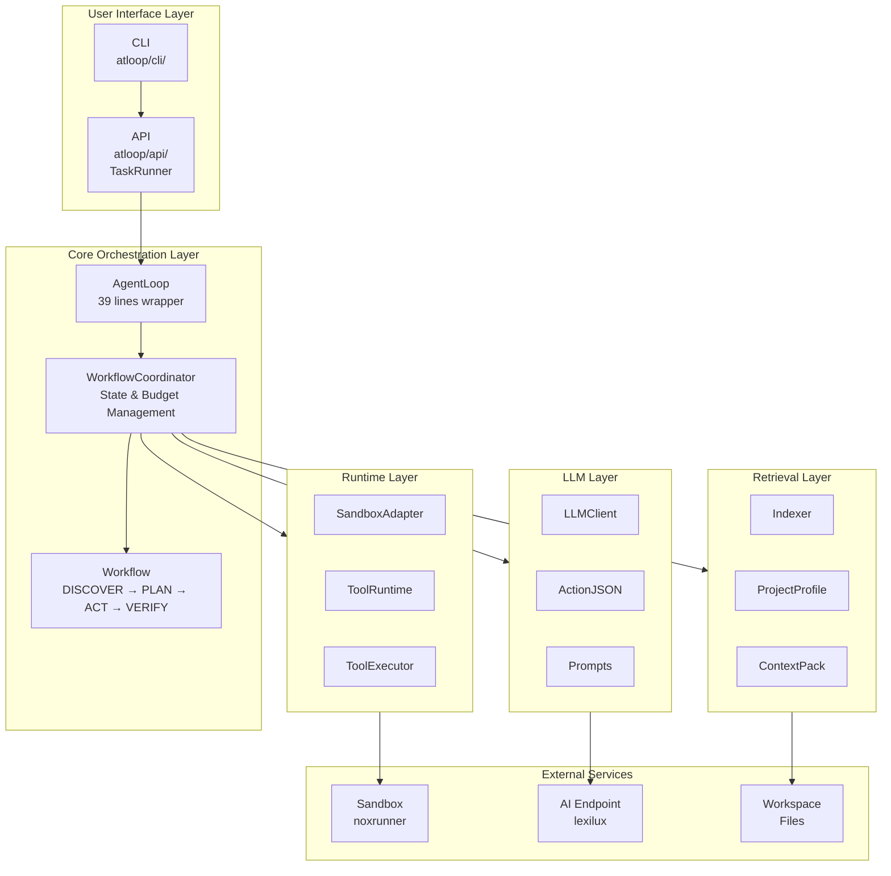
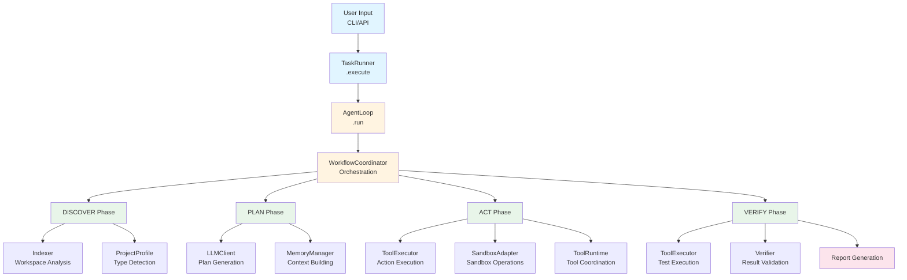
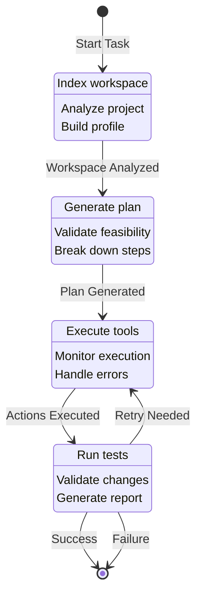

# atloop Documentation

**Tool-Integrated Task Automation Node** - AI-powered autonomous code execution system

## Overview

atloop is an AI-powered task automation system that autonomously executes coding tasks in isolated sandbox environments. It can understand task requirements, analyze code, generate solutions, execute changes, and verify results—all while maintaining complete audit trails.

## Quick Navigation

- **[Architecture](ARCHITECTURE.md)** - System architecture and design principles
- **[Features](FEATURES.md)** - Complete feature documentation
- **[Usage Guide](USAGE.md)** - CLI and API usage instructions

## Architecture Overview

### High-Level Architecture



### Component Interaction Flow




## Core Workflow

### Workflow State Machine



### Workflow Phases

1. **DISCOVER** - Analyze workspace and understand requirements
   - Index workspace files
   - Detect project type (Python, Node.js, Go, etc.)
   - Build project profile
   - Understand task context

2. **PLAN** - Generate execution plan
   - Break down task into steps
   - Identify required tools
   - Create action sequence
   - Validate plan feasibility

3. **ACT** - Execute tool calls
   - Run filesystem operations
   - Execute code modifications
   - Run commands in sandbox
   - Handle errors and retries

4. **VERIFY** - Verify results
   - Run tests
   - Validate changes
   - Check constraints
   - Generate report

## Key Features

### 🎯 Task Types

- **Bugfix**: Automatically identify and fix code bugs
- **Feature**: Implement new features from requirements
- **Refactor**: Refactor code while maintaining behavior

### 🔍 Intelligent Code Retrieval

- **Workspace Indexing**: Fast code search and retrieval
- **Project Type Detection**: Automatic detection of Python, Node.js, Go projects
- **Context Building**: Smart context packing for LLM

### 🧠 Memory Management

- **State Persistence**: Job state saved to disk
- **History Compression**: Automatic memory compression
- **Resume Support**: Recover from failures

### 📊 Budget Management

- **LLM Call Limits**: Control AI API usage
- **Tool Call Limits**: Limit tool executions
- **Time Budgets**: Maximum execution time

### 📝 Event Logging

- **Complete Audit Trail**: All operations logged
- **Event Replay**: Replay execution history
- **Report Generation**: Markdown reports

### 🔒 Sandbox Execution

- **Isolated Environment**: Safe code execution
- **File Synchronization**: Automatic workspace sync
- **Local Testing**: Test without remote sandbox

## Installation

### Using uv (Recommended)

```bash
# Install uv
curl -LsSf https://astral.sh/uv/install.sh | sh

# Install atloop
cd atloop
make dev-install
```

### Using pip

```bash
pip install atloop
```

## Quick Start Examples

### Example 1: Fix a Bug

```bash
atloop execute \
  --workspace ./my-project \
  --prompt "Fix the failing test in tests/test_math.py" \
  --local-test
```

### Example 2: Implement a Feature

```bash
atloop execute \
  --workspace ./my-project \
  --prompt "Add user authentication with login and logout endpoints" \
  --sandbox-url http://127.0.0.1:8080
```

### Example 3: Using API

```python
from atloop.api.runner import TaskRunner

# Initialize runner
runner = TaskRunner()

# Execute task
task_config = {
    "goal": "Fix the bug in src/main.py",
    "workspace_root": "/path/to/project",
    "task_type": "bugfix",
    "sandbox": {
        "base_url": "http://127.0.0.1:8080",
        "local_test": False
    }
}

result = runner.execute(task_config)
print(f"Status: {result['status']}")
print(f"Report: {result.get('report', '')}")
```

### Example 4: Custom Budget

```python
from atloop.api.runner import TaskRunner, load_task_spec
from atloop.config.models import SandboxConfig
from atloop.orchestrator import AgentLoop

# Load task with custom budget
task = load_task_spec(
    goal="Implement user authentication",
    workspace_root="/path/to/project",
    task_type="feature",
    budget={
        "max_llm_calls": 50,
        "max_tool_calls": 100,
        "max_wall_time_sec": 600
    }
)

# Configure sandbox
sandbox_config = SandboxConfig(
    base_url="http://127.0.0.1:8080",
    local_test=False
)

# Run agent
from atloop.config.loader import ConfigLoader
ConfigLoader.setup()
config = ConfigLoader.get()

loop = AgentLoop(task, config, sandbox_config)
report = loop.run()
```

### Example 5: Local Testing Mode

```python
from atloop.api.runner import TaskRunner

runner = TaskRunner()

# Use local sandbox (no remote service needed)
task_config = {
    "goal": "Write a simple Python script that prints hello",
    "workspace_root": "./test_workspace",
    "sandbox": {
        "base_url": None,
        "local_test": True
    }
}

result = runner.execute(task_config, console=True)
```

### Example 6: Complete Workflow with File Creation

```python
#!/usr/bin/env python3
"""Complete example: Create and test a Python module."""

from atloop.api.runner import TaskRunner
from pathlib import Path

# Initialize runner
runner = TaskRunner()

# Task: Create a calculator module with tests
task_config = {
    "goal": "Create a calculator.py module with add, subtract, multiply, divide functions and corresponding tests",
    "workspace_root": "./my_project",
    "task_type": "feature",
    "sandbox": {
        "base_url": None,
        "local_test": True
    }
}

# Execute
result = runner.execute(task_config, console=True)

# Check results
if result["success"]:
    print("✅ Task completed successfully!")
    print(f"Status: {result['status']}")
    
    # Verify files were created
    calc_file = Path("./my_project/calculator.py")
    test_file = Path("./my_project/test_calculator.py")
    
    if calc_file.exists():
        print(f"✅ Created: {calc_file}")
    if test_file.exists():
        print(f"✅ Created: {test_file}")
else:
    print(f"❌ Task failed: {result.get('error', 'Unknown error')}")
```

### Example 7: Event Replay

```python
from atloop.logging import EventReplay
from pathlib import Path

# Replay execution history
replay = EventReplay(Path("runs/task_id/events.jsonl"))
summary = replay.replay_to_step(10)
print(f"Total events: {summary['total_events']}")
print(f"Steps: {summary['steps']}")
```

### Example 8: Generate Report

```python
from atloop.logging import ReportGenerator
from pathlib import Path

# Generate markdown report
generator = ReportGenerator(Path("runs/task_id/events.jsonl"))
report = generator.generate_success_report("task_id", "Fix bug in main.py")
markdown = generator.generate_markdown_report(report, Path("report.md"))
```

### Example 9: Bug Fix with Constraints

```python
from atloop.api.runner import TaskRunner, load_task_spec
from atloop.config.models import SandboxConfig
from atloop.orchestrator import AgentLoop
from atloop.config.loader import ConfigLoader

# Setup configuration
ConfigLoader.setup()
config = ConfigLoader.get()

# Create task with constraints
task = load_task_spec(
    goal="Fix the failing test in tests/test_math.py",
    workspace_root="/path/to/project",
    task_type="bugfix",
    constraints=[
        "All existing tests must pass",
        "No breaking changes to public API",
        "Follow project coding standards"
    ]
)

# Configure sandbox
sandbox_config = SandboxConfig(
    base_url="http://127.0.0.1:8080",
    local_test=False
)

# Execute
loop = AgentLoop(task, config, sandbox_config)
report = loop.run()

if report["status"] == "success":
    print("✅ Bug fixed successfully!")
    print(f"Diff:\n{report.get('diff', '')}")
```

### Example 10: Using Prompt File

```bash
# Create prompt file
cat > task_prompt.txt << EOF
Implement a REST API endpoint for user registration:
- Endpoint: POST /api/users/register
- Accept: email, password, name
- Validate input
- Hash password
- Save to database
- Return user ID
- Add unit tests
EOF

# Execute with prompt file
atloop execute \
  --workspace ./my-api-project \
  --prompt-file task_prompt.txt \
  --local-test
```

## Project Structure

```
atloop/
├── atloop/                    # Core library
│   ├── api/                  # API layer (TaskRunner)
│   ├── cli/                  # CLI layer (minimal, varlord)
│   ├── config/               # Configuration (varlord)
│   ├── llm/                  # LLM client (lexilux)
│   ├── orchestrator/         # Workflow orchestration
│   │   ├── agent_loop.py    # Thin wrapper (39 lines)
│   │   ├── coordinator.py   # State & budget management
│   │   ├── workflow.py      # DISCOVER → PLAN → ACT → VERIFY
│   │   └── phases/          # Phase implementations
│   ├── runtime/              # Runtime execution
│   │   ├── sandbox_adapter.py  # noxrunner integration
│   │   └── tool_runtime.py     # Tool execution
│   ├── retrieval/            # Code retrieval
│   │   ├── indexer.py        # Workspace indexing
│   │   └── project_profile.py # Project analysis
│   ├── memory/               # Memory management
│   │   └── memory_manager.py # State compression
│   ├── logging/              # Event logging
│   │   ├── event_logger.py   # Event recording
│   │   └── report.py         # Report generation
│   └── tools/                # Tool implementations
│       └── registry.py       # Tool registration
├── tests/                     # Test suite
├── docs/                      # Documentation
└── runs/                      # Execution logs
```

## Dependencies

### Core Dependencies

- **lexilux**: LLM client communication
- **noxrunner**: Sandbox execution (v2.0.0+ with unified file sync)
- **varlord**: Type-safe configuration management

### Development Dependencies

- **pytest**: Testing framework
- **ruff**: Code linting and formatting
- **mypy**: Type checking

## Configuration

atloop uses **varlord** for type-safe configuration management:

### Configuration Sources (Priority Order)

1. Environment variables (`ATLOOP__*`)
2. `.env` file (in current directory)
3. Project config (`./.atloop/config/atloop.yaml`)
4. User config (`~/.atloop/config/atloop.yaml`)

### Key Configuration Models

- `AtloopConfig`: Main configuration
- `TaskSpec`: Task specification
- `Budget`: Execution budget limits
- `SandboxConfig`: Sandbox configuration

See [USAGE.md](USAGE.md) for detailed configuration examples.

## Testing

```bash
# Run all tests
make test

# Run specific test category
pytest tests/test_e2e_cli_subprocess.py

# Run with coverage
make test-cov
```

## Design Principles

### 1. Simple
- One function, one method
- Minimal interfaces
- Few parameters

### 2. Clear
- One class, one responsibility
- Clear directory structure
- Self-documenting code

### 3. Explicit
- Predictable behavior
- No hidden side effects
- Type-safe configuration

### 4. Unique
- Single workflow: DISCOVER → PLAN → ACT → VERIFY
- One execution method: `TaskRunner.execute()`
- No redundant implementations

## Integration with noxrunner v2.0.0

atloop integrates with **noxrunner v2.0.0** for sandbox execution:

- **Unified Interface**: `NoxRunnerClient` provides consistent API
- **Automatic File Sync**: `download_workspace()` handles file synchronization
- **Backend Agnostic**: Works with both local and remote backends
- **No Backend Differentiation**: Business code doesn't need to know backend type

### Sandbox Configuration

```python
# Local testing (no remote service)
sandbox_config = SandboxConfig(
    base_url=None,
    local_test=True
)

# Remote sandbox
sandbox_config = SandboxConfig(
    base_url="http://127.0.0.1:8080",
    local_test=False
)
```

## Next Steps

- Read the [Architecture Guide](ARCHITECTURE.md) for detailed design
- Check the [Features Documentation](FEATURES.md) for complete feature list
- Follow the [Usage Guide](USAGE.md) for CLI and API examples
- Explore the codebase to understand implementation details

## License

[To be determined]
